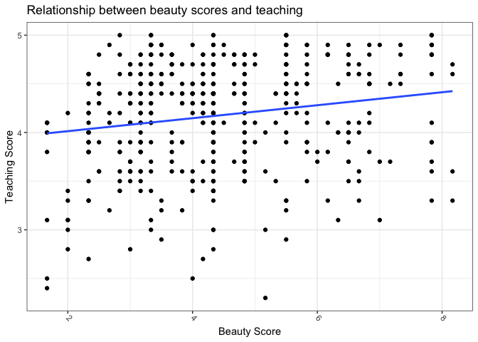

Chapter\_10
================

Code for the Chapter 10 of the [Modern Dive
book](https://moderndive.com/10-inference-for-regression.html).

``` r
library(tidyverse)
```

    ## ── Attaching packages ─────────────────────────────────────── tidyverse 1.3.1 ──

    ## ✓ ggplot2 3.3.5     ✓ purrr   0.3.4
    ## ✓ tibble  3.1.3     ✓ dplyr   1.0.7
    ## ✓ tidyr   1.1.3     ✓ stringr 1.4.0
    ## ✓ readr   2.0.1     ✓ forcats 0.5.1

    ## ── Conflicts ────────────────────────────────────────── tidyverse_conflicts() ──
    ## x dplyr::filter() masks stats::filter()
    ## x dplyr::lag()    masks stats::lag()

``` r
library(infer)
library(moderndive)
library(ggthemes)
```

Set the palette and the running theme for ggplot2.

``` r
theme_set(theme_bw())
theme_update(axis.text.x = element_text(
angle = -45,
hjust = 0,
vjust = 0.5
))
```

## 10.1

### 10.1.1

``` r
evals_ch5 <- evals %>%
  select(ID, score, bty_avg, age) 

glimpse(evals_ch5)
```

    ## Rows: 463
    ## Columns: 4
    ## $ ID      <int> 1, 2, 3, 4, 5, 6, 7, 8, 9, 10, 11, 12, 13, 14, 15, 16, 17, 18,…
    ## $ score   <dbl> 4.7, 4.1, 3.9, 4.8, 4.6, 4.3, 2.8, 4.1, 3.4, 4.5, 3.8, 4.5, 4.…
    ## $ bty_avg <dbl> 5.000, 5.000, 5.000, 5.000, 3.000, 3.000, 3.000, 3.333, 3.333,…
    ## $ age     <int> 36, 36, 36, 36, 59, 59, 59, 51, 51, 40, 40, 40, 40, 40, 40, 40…

``` r
evals_ch5 %>%
  ggplot(aes(bty_avg, score)) +
  geom_point() +
  geom_smooth(method = "lm", se = FALSE) +
  labs(x = "Beauty Score",
       y = "Teaching Score",
       title = "Relationship between beauty scores and teaching")
```

    ## `geom_smooth()` using formula 'y ~ x'

<!-- -->

``` r
score_model <- lm(score ~ bty_avg, data = evals_ch5)

get_regression_table(score_model)
```

    ## # A tibble: 2 × 7
    ##   term      estimate std_error statistic p_value lower_ci upper_ci
    ##   <chr>        <dbl>     <dbl>     <dbl>   <dbl>    <dbl>    <dbl>
    ## 1 intercept    3.88      0.076     51.0        0    3.73     4.03 
    ## 2 bty_avg      0.067     0.016      4.09       0    0.035    0.099

Document the information about the analysis session

``` r
sessionInfo()
```

    ## R version 4.1.1 (2021-08-10)
    ## Platform: x86_64-apple-darwin17.0 (64-bit)
    ## Running under: macOS Big Sur 10.16
    ## 
    ## Matrix products: default
    ## BLAS:   /Library/Frameworks/R.framework/Versions/4.1/Resources/lib/libRblas.0.dylib
    ## LAPACK: /Library/Frameworks/R.framework/Versions/4.1/Resources/lib/libRlapack.dylib
    ## 
    ## locale:
    ## [1] en_US.UTF-8/en_US.UTF-8/en_US.UTF-8/C/en_US.UTF-8/en_US.UTF-8
    ## 
    ## attached base packages:
    ## [1] stats     graphics  grDevices datasets  utils     methods   base     
    ## 
    ## other attached packages:
    ##  [1] ggthemes_4.2.4   moderndive_0.5.2 infer_1.0.0      forcats_0.5.1   
    ##  [5] stringr_1.4.0    dplyr_1.0.7      purrr_0.3.4      readr_2.0.1     
    ##  [9] tidyr_1.1.3      tibble_3.1.3     ggplot2_3.3.5    tidyverse_1.3.1 
    ## 
    ## loaded via a namespace (and not attached):
    ##  [1] Rcpp_1.0.7           lattice_0.20-44      lubridate_1.7.10    
    ##  [4] formula.tools_1.7.1  assertthat_0.2.1     digest_0.6.27       
    ##  [7] utf8_1.2.2           R6_2.5.1             cellranger_1.1.0    
    ## [10] backports_1.2.1      reprex_2.0.1         evaluate_0.14       
    ## [13] highr_0.9            httr_1.4.2           pillar_1.6.2        
    ## [16] rlang_0.4.11         readxl_1.3.1         rstudioapi_0.13     
    ## [19] Matrix_1.3-4         rmarkdown_2.10       labeling_0.4.2      
    ## [22] splines_4.1.1        munsell_0.5.0        broom_0.7.9         
    ## [25] compiler_4.1.1       modelr_0.1.8         janitor_2.1.0       
    ## [28] xfun_0.25            pkgconfig_2.0.3      mgcv_1.8-36         
    ## [31] htmltools_0.5.1.1    tidyselect_1.1.1     fansi_0.5.0         
    ## [34] crayon_1.4.1         tzdb_0.1.2           dbplyr_2.1.1        
    ## [37] withr_2.4.2          grid_4.1.1           nlme_3.1-152        
    ## [40] jsonlite_1.7.2       gtable_0.3.0         lifecycle_1.0.0     
    ## [43] DBI_1.1.1            magrittr_2.0.1       scales_1.1.1        
    ## [46] cli_3.0.1            stringi_1.7.3        farver_2.1.0        
    ## [49] renv_0.14.0          fs_1.5.0             snakecase_0.11.0    
    ## [52] xml2_1.3.2           ellipsis_0.3.2       generics_0.1.0      
    ## [55] vctrs_0.3.8          tools_4.1.1          glue_1.4.2          
    ## [58] hms_1.1.0            yaml_2.2.1           colorspace_2.0-2    
    ## [61] operator.tools_1.6.3 rvest_1.0.1          knitr_1.33          
    ## [64] haven_2.4.3
