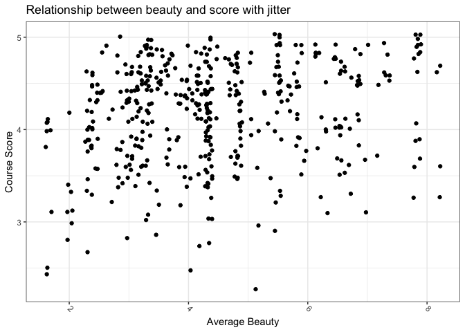
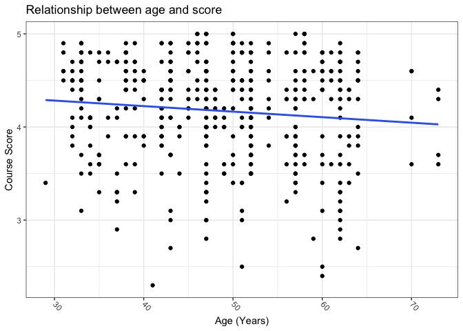

Chapter\_5
================

Code for the Chapter 5 of the [Modern Dive
book](https://moderndive.com/5-regression.html#regression).

``` r
library(tidyverse)
```

    ## ── Attaching packages ─────────────────────────────────────── tidyverse 1.3.1 ──

    ## ✓ ggplot2 3.3.5     ✓ purrr   0.3.4
    ## ✓ tibble  3.1.3     ✓ dplyr   1.0.7
    ## ✓ tidyr   1.1.3     ✓ stringr 1.4.0
    ## ✓ readr   2.0.1     ✓ forcats 0.5.1

    ## ── Conflicts ────────────────────────────────────────── tidyverse_conflicts() ──
    ## x dplyr::filter() masks stats::filter()
    ## x dplyr::lag()    masks stats::lag()

``` r
library(moderndive)
library(skimr)
library(gapminder)
```

## 5.1

``` r
glimpse(evals)
```

    ## Rows: 463
    ## Columns: 14
    ## $ ID           <int> 1, 2, 3, 4, 5, 6, 7, 8, 9, 10, 11, 12, 13, 14, 15, 16, 17…
    ## $ prof_ID      <int> 1, 1, 1, 1, 2, 2, 2, 3, 3, 4, 4, 4, 4, 4, 4, 4, 4, 5, 5, …
    ## $ score        <dbl> 4.7, 4.1, 3.9, 4.8, 4.6, 4.3, 2.8, 4.1, 3.4, 4.5, 3.8, 4.…
    ## $ age          <int> 36, 36, 36, 36, 59, 59, 59, 51, 51, 40, 40, 40, 40, 40, 4…
    ## $ bty_avg      <dbl> 5.000, 5.000, 5.000, 5.000, 3.000, 3.000, 3.000, 3.333, 3…
    ## $ gender       <fct> female, female, female, female, male, male, male, male, m…
    ## $ ethnicity    <fct> minority, minority, minority, minority, not minority, not…
    ## $ language     <fct> english, english, english, english, english, english, eng…
    ## $ rank         <fct> tenure track, tenure track, tenure track, tenure track, t…
    ## $ pic_outfit   <fct> not formal, not formal, not formal, not formal, not forma…
    ## $ pic_color    <fct> color, color, color, color, color, color, color, color, c…
    ## $ cls_did_eval <int> 24, 86, 76, 77, 17, 35, 39, 55, 111, 40, 24, 24, 17, 14, …
    ## $ cls_students <int> 43, 125, 125, 123, 20, 40, 44, 55, 195, 46, 27, 25, 20, 2…
    ## $ cls_level    <fct> upper, upper, upper, upper, upper, upper, upper, upper, u…

### 5.1

``` r
evals_ch5 <- evals %>%
  select(ID, score:bty_avg)

glimpse(evals_ch5)
```

    ## Rows: 463
    ## Columns: 4
    ## $ ID      <int> 1, 2, 3, 4, 5, 6, 7, 8, 9, 10, 11, 12, 13, 14, 15, 16, 17, 18,…
    ## $ score   <dbl> 4.7, 4.1, 3.9, 4.8, 4.6, 4.3, 2.8, 4.1, 3.4, 4.5, 3.8, 4.5, 4.…
    ## $ age     <int> 36, 36, 36, 36, 59, 59, 59, 51, 51, 40, 40, 40, 40, 40, 40, 40…
    ## $ bty_avg <dbl> 5.000, 5.000, 5.000, 5.000, 3.000, 3.000, 3.000, 3.333, 3.333,…

``` r
set.seed(42)

evals_ch5 %>%
  sample_n(size = 5)
```

    ## # A tibble: 5 × 4
    ##      ID score   age bty_avg
    ##   <int> <dbl> <int>   <dbl>
    ## 1    49   4.5    33    4.67
    ## 2   321   3.8    52    2.33
    ## 3   153   4.2    52    4.83
    ## 4    74   3.8    42    4.83
    ## 5   228   4.7    39    8.17

``` r
evals_ch5 %>%
  summarise(across(c(bty_avg, score),
                   list(mean = mean, median = median)))
```

    ## # A tibble: 1 × 4
    ##   bty_avg_mean bty_avg_median score_mean score_median
    ##          <dbl>          <dbl>      <dbl>        <dbl>
    ## 1         4.42           4.33       4.17          4.3

``` r
evals_ch5 %>%
  select(bty_avg, score) %>%
  skim()
```

|                                                  |            |
|:-------------------------------------------------|:-----------|
| Name                                             | Piped data |
| Number of rows                                   | 463        |
| Number of columns                                | 2          |
| \_\_\_\_\_\_\_\_\_\_\_\_\_\_\_\_\_\_\_\_\_\_\_   |            |
| Column type frequency:                           |            |
| numeric                                          | 2          |
| \_\_\_\_\_\_\_\_\_\_\_\_\_\_\_\_\_\_\_\_\_\_\_\_ |            |
| Group variables                                  | None       |

Data summary

**Variable type: numeric**

| skim\_variable | n\_missing | complete\_rate | mean |   sd |   p0 |  p25 |  p50 | p75 | p100 | hist  |
|:---------------|-----------:|---------------:|-----:|-----:|-----:|-----:|-----:|----:|-----:|:------|
| bty\_avg       |          0 |              1 | 4.42 | 1.53 | 1.67 | 3.17 | 4.33 | 5.5 | 8.17 | ▃▇▇▃▂ |
| score          |          0 |              1 | 4.17 | 0.54 | 2.30 | 3.80 | 4.30 | 4.6 | 5.00 | ▁▁▅▇▇ |

``` r
evals_ch5 %>%
  summarise(correlation = cor(bty_avg, score))
```

    ## # A tibble: 1 × 1
    ##   correlation
    ##         <dbl>
    ## 1       0.187

``` r
evals_ch5 %>%
  ggplot(aes(x = bty_avg, y = score)) +
  geom_point() +
  labs(x = "Average Beauty",
       y = "Course Score",
       title = "Relationship between beauty and score")
```

<!-- -->

``` r
evals_ch5 %>%
  ggplot(aes(x = bty_avg, y = score)) +
  geom_jitter() +
  labs(x = "Average Beauty",
       y = "Course Score",
       title = "Relationship between beauty and score with jitter")
```

<!-- -->

``` r
evals_ch5 %>%
  ggplot(aes(x = bty_avg, y = score)) +
  geom_point() +
  labs(x = "Average Beauty",
       y = "Course Score",
       title = "Relationship between beauty and score") +
  geom_smooth(method = "lm",
              se = FALSE)
```

    ## `geom_smooth()` using formula 'y ~ x'

<!-- -->

### LC5.1

``` r
evals_ch5 %>%
  select(score, age) %>%
  skim()
```

|                                                  |            |
|:-------------------------------------------------|:-----------|
| Name                                             | Piped data |
| Number of rows                                   | 463        |
| Number of columns                                | 2          |
| \_\_\_\_\_\_\_\_\_\_\_\_\_\_\_\_\_\_\_\_\_\_\_   |            |
| Column type frequency:                           |            |
| numeric                                          | 2          |
| \_\_\_\_\_\_\_\_\_\_\_\_\_\_\_\_\_\_\_\_\_\_\_\_ |            |
| Group variables                                  | None       |

Data summary

**Variable type: numeric**

| skim\_variable | n\_missing | complete\_rate |  mean |   sd |   p0 |  p25 |  p50 |  p75 | p100 | hist  |
|:---------------|-----------:|---------------:|------:|-----:|-----:|-----:|-----:|-----:|-----:|:------|
| score          |          0 |              1 |  4.17 | 0.54 |  2.3 |  3.8 |  4.3 |  4.6 |    5 | ▁▁▅▇▇ |
| age            |          0 |              1 | 48.37 | 9.80 | 29.0 | 42.0 | 48.0 | 57.0 |   73 | ▅▆▇▆▁ |

``` r
evals_ch5 %>%
  get_correlation(score ~ age)
```

    ## # A tibble: 1 × 1
    ##      cor
    ##    <dbl>
    ## 1 -0.107

``` r
evals_ch5 %>%
  ggplot(aes(x = age, y = score)) +
  geom_point() +
  labs(x = "Age (Years)",
       y = "Course Score",
       title = "Relationship between age and score") +
  geom_smooth(method = "lm",
              se = FALSE)
```

    ## `geom_smooth()` using formula 'y ~ x'

<!-- --> \#\#\#
5.1.2

``` r
score_model_1 <- lm(score ~ bty_avg, data = evals_ch5)
get_regression_table(score_model_1)
```

    ## # A tibble: 2 × 7
    ##   term      estimate std_error statistic p_value lower_ci upper_ci
    ##   <chr>        <dbl>     <dbl>     <dbl>   <dbl>    <dbl>    <dbl>
    ## 1 intercept    3.88      0.076     51.0        0    3.73     4.03 
    ## 2 bty_avg      0.067     0.016      4.09       0    0.035    0.099

### LC5.2

``` r
score_model_2 <- lm(score ~ age, data = evals_ch5)
get_regression_table(score_model_2)
```

    ## # A tibble: 2 × 7
    ##   term      estimate std_error statistic p_value lower_ci upper_ci
    ##   <chr>        <dbl>     <dbl>     <dbl>   <dbl>    <dbl>    <dbl>
    ## 1 intercept    4.46      0.127     35.2    0        4.21     4.71 
    ## 2 age         -0.006     0.003     -2.31   0.021   -0.011   -0.001

``` r
score_model_3 <- lm(score ~ bty_avg + age , data = evals_ch5)
get_regression_table(score_model_3)
```

    ## # A tibble: 3 × 7
    ##   term      estimate std_error statistic p_value lower_ci upper_ci
    ##   <chr>        <dbl>     <dbl>     <dbl>   <dbl>    <dbl>    <dbl>
    ## 1 intercept    4.06      0.17      23.9    0        3.72     4.39 
    ## 2 bty_avg      0.061     0.017      3.55   0        0.027    0.094
    ## 3 age         -0.003     0.003     -1.15   0.251   -0.008    0.002

### 5.1.3

``` r
regression_points_1 <- get_regression_points(score_model_1)

regression_points_1
```

    ## # A tibble: 463 × 5
    ##       ID score bty_avg score_hat residual
    ##    <int> <dbl>   <dbl>     <dbl>    <dbl>
    ##  1     1   4.7    5         4.21    0.486
    ##  2     2   4.1    5         4.21   -0.114
    ##  3     3   3.9    5         4.21   -0.314
    ##  4     4   4.8    5         4.21    0.586
    ##  5     5   4.6    3         4.08    0.52 
    ##  6     6   4.3    3         4.08    0.22 
    ##  7     7   2.8    3         4.08   -1.28 
    ##  8     8   4.1    3.33      4.10   -0.002
    ##  9     9   3.4    3.33      4.10   -0.702
    ## 10    10   4.5    3.17      4.09    0.409
    ## # … with 453 more rows

### LC5.3

``` r
regression_points_2 <- get_regression_points(score_model_2)

regression_points_2
```

    ## # A tibble: 463 × 5
    ##       ID score   age score_hat residual
    ##    <int> <dbl> <int>     <dbl>    <dbl>
    ##  1     1   4.7    36      4.25    0.452
    ##  2     2   4.1    36      4.25   -0.148
    ##  3     3   3.9    36      4.25   -0.348
    ##  4     4   4.8    36      4.25    0.552
    ##  5     5   4.6    59      4.11    0.488
    ##  6     6   4.3    59      4.11    0.188
    ##  7     7   2.8    59      4.11   -1.31 
    ##  8     8   4.1    51      4.16   -0.059
    ##  9     9   3.4    51      4.16   -0.759
    ## 10    10   4.5    40      4.22    0.276
    ## # … with 453 more rows

Document the information about the analysis session

``` r
sessionInfo()
```

    ## R version 4.1.1 (2021-08-10)
    ## Platform: aarch64-apple-darwin20 (64-bit)
    ## Running under: macOS Big Sur 11.5.2
    ## 
    ## Matrix products: default
    ## BLAS:   /Library/Frameworks/R.framework/Versions/4.1-arm64/Resources/lib/libRblas.0.dylib
    ## LAPACK: /Library/Frameworks/R.framework/Versions/4.1-arm64/Resources/lib/libRlapack.dylib
    ## 
    ## locale:
    ## [1] en_US.UTF-8/en_US.UTF-8/en_US.UTF-8/C/en_US.UTF-8/en_US.UTF-8
    ## 
    ## attached base packages:
    ## [1] stats     graphics  grDevices datasets  utils     methods   base     
    ## 
    ## other attached packages:
    ##  [1] gapminder_0.3.0  skimr_2.1.3      moderndive_0.5.2 forcats_0.5.1   
    ##  [5] stringr_1.4.0    dplyr_1.0.7      purrr_0.3.4      readr_2.0.1     
    ##  [9] tidyr_1.1.3      tibble_3.1.3     ggplot2_3.3.5    tidyverse_1.3.1 
    ## 
    ## loaded via a namespace (and not attached):
    ##  [1] httr_1.4.2           jsonlite_1.7.2       splines_4.1.1       
    ##  [4] modelr_0.1.8         assertthat_0.2.1     highr_0.9           
    ##  [7] renv_0.14.0          cellranger_1.1.0     yaml_2.2.1          
    ## [10] pillar_1.6.2         backports_1.2.1      lattice_0.20-44     
    ## [13] glue_1.4.2           digest_0.6.27        rvest_1.0.1         
    ## [16] snakecase_0.11.0     colorspace_2.0-2     htmltools_0.5.1.1   
    ## [19] Matrix_1.3-4         infer_1.0.0          pkgconfig_2.0.3     
    ## [22] broom_0.7.9          haven_2.4.3          scales_1.1.1        
    ## [25] tzdb_0.1.2           mgcv_1.8-36          generics_0.1.0      
    ## [28] farver_2.1.0         ellipsis_0.3.2       withr_2.4.2         
    ## [31] janitor_2.1.0        repr_1.1.3           formula.tools_1.7.1 
    ## [34] cli_3.0.1            magrittr_2.0.1       crayon_1.4.1        
    ## [37] readxl_1.3.1         evaluate_0.14        fs_1.5.0            
    ## [40] fansi_0.5.0          operator.tools_1.6.3 nlme_3.1-152        
    ## [43] xml2_1.3.2           tools_4.1.1          hms_1.1.0           
    ## [46] lifecycle_1.0.0      munsell_0.5.0        reprex_2.0.1        
    ## [49] compiler_4.1.1       rlang_0.4.11         grid_4.1.1          
    ## [52] rstudioapi_0.13      base64enc_0.1-3      labeling_0.4.2      
    ## [55] rmarkdown_2.10       gtable_0.3.0         DBI_1.1.1           
    ## [58] R6_2.5.0             lubridate_1.7.10     knitr_1.33          
    ## [61] utf8_1.2.2           stringi_1.7.3        Rcpp_1.0.7          
    ## [64] vctrs_0.3.8          dbplyr_2.1.1         tidyselect_1.1.1    
    ## [67] xfun_0.25
