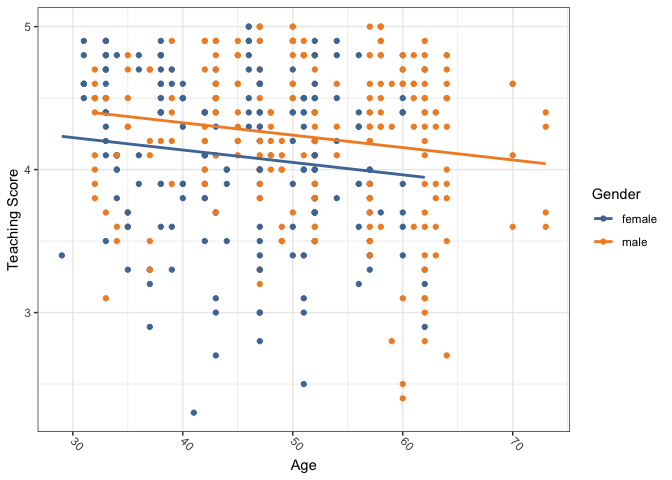
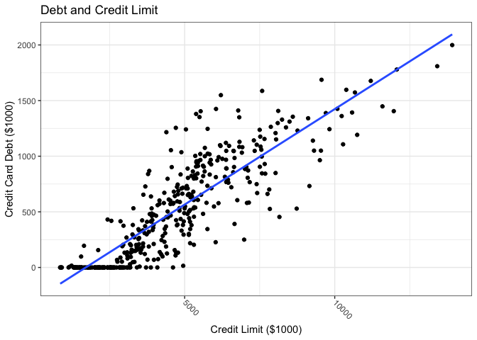
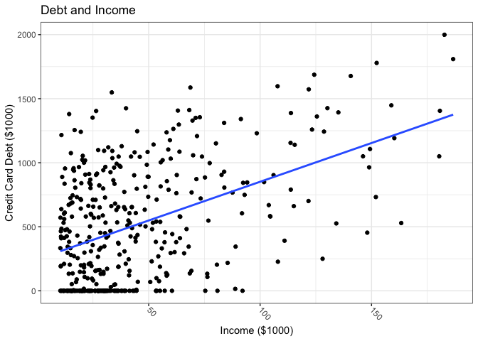
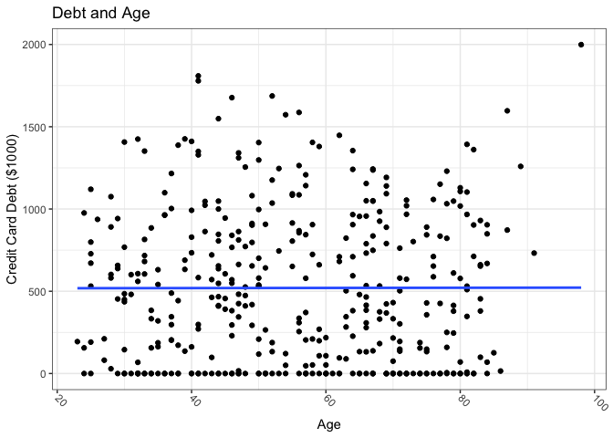
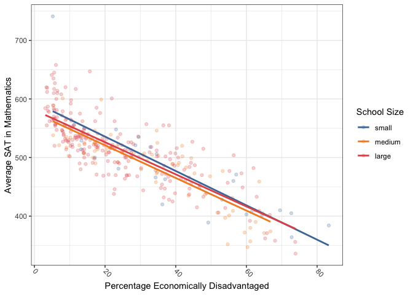
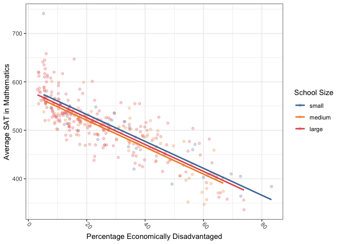

Chapter\_6
================

Code for the Chapter 6 of the [Modern Dive
book](https://moderndive.com/6-multiple-regression.html).

``` r
library(tidyverse)
```

    ## ── Attaching packages ─────────────────────────────────────── tidyverse 1.3.1 ──

    ## ✓ ggplot2 3.3.5     ✓ purrr   0.3.4
    ## ✓ tibble  3.1.3     ✓ dplyr   1.0.7
    ## ✓ tidyr   1.1.3     ✓ stringr 1.4.0
    ## ✓ readr   2.0.1     ✓ forcats 0.5.1

    ## ── Conflicts ────────────────────────────────────────── tidyverse_conflicts() ──
    ## x dplyr::filter() masks stats::filter()
    ## x dplyr::lag()    masks stats::lag()

``` r
library(moderndive)
library(skimr)
library(ISLR)
library(ggthemes)
```

Set the palette and the running theme for ggplot2.

``` r
theme_set(theme_bw())
theme_update(axis.text.x = element_text(
angle = -45,
hjust = 0,
vjust = 0.5
))
```

## 6.1

``` r
evals_ch6 <- evals %>%
  select(ID, score, age, gender)

glimpse(evals_ch6)
```

    ## Rows: 463
    ## Columns: 4
    ## $ ID     <int> 1, 2, 3, 4, 5, 6, 7, 8, 9, 10, 11, 12, 13, 14, 15, 16, 17, 18, …
    ## $ score  <dbl> 4.7, 4.1, 3.9, 4.8, 4.6, 4.3, 2.8, 4.1, 3.4, 4.5, 3.8, 4.5, 4.6…
    ## $ age    <int> 36, 36, 36, 36, 59, 59, 59, 51, 51, 40, 40, 40, 40, 40, 40, 40,…
    ## $ gender <fct> female, female, female, female, male, male, male, male, male, f…

``` r
evals_ch6 %>%
  summarise(across(c(age, score),
                   list(mean = mean, median = median)))
```

    ## # A tibble: 1 × 4
    ##   age_mean age_median score_mean score_median
    ##      <dbl>      <int>      <dbl>        <dbl>
    ## 1     48.4         48       4.17          4.3

``` r
evals_ch6 %>%
  skim()
```

|                                                  |            |
|:-------------------------------------------------|:-----------|
| Name                                             | Piped data |
| Number of rows                                   | 463        |
| Number of columns                                | 4          |
| \_\_\_\_\_\_\_\_\_\_\_\_\_\_\_\_\_\_\_\_\_\_\_   |            |
| Column type frequency:                           |            |
| factor                                           | 1          |
| numeric                                          | 3          |
| \_\_\_\_\_\_\_\_\_\_\_\_\_\_\_\_\_\_\_\_\_\_\_\_ |            |
| Group variables                                  | None       |

Data summary

**Variable type: factor**

| skim\_variable | n\_missing | complete\_rate | ordered | n\_unique | top\_counts        |
|:---------------|-----------:|---------------:|:--------|----------:|:-------------------|
| gender         |          0 |              1 | FALSE   |         2 | mal: 268, fem: 195 |

**Variable type: numeric**

| skim\_variable | n\_missing | complete\_rate |   mean |     sd |   p0 |   p25 |   p50 |   p75 | p100 | hist  |
|:---------------|-----------:|---------------:|-------:|-------:|-----:|------:|------:|------:|-----:|:------|
| ID             |          0 |              1 | 232.00 | 133.80 |  1.0 | 116.5 | 232.0 | 347.5 |  463 | ▇▇▇▇▇ |
| score          |          0 |              1 |   4.17 |   0.54 |  2.3 |   3.8 |   4.3 |   4.6 |    5 | ▁▁▅▇▇ |
| age            |          0 |              1 |  48.37 |   9.80 | 29.0 |  42.0 |  48.0 |  57.0 |   73 | ▅▆▇▆▁ |

``` r
evals_ch6 %>%
  get_correlation(score ~ age)
```

    ## # A tibble: 1 × 1
    ##      cor
    ##    <dbl>
    ## 1 -0.107

``` r
evals_ch6 %>%
  ggplot(aes(x = age, 
             y = score,
             color = gender)) +
  geom_point() +
  geom_smooth(method = "lm", se = FALSE) +
  scale_color_tableau(name = "Gender") +
  labs(x = "Age",
       y = "Teaching Score")
```

    ## `geom_smooth()` using formula 'y ~ x'

<!-- -->

``` r
score_model_interaction <- lm(score ~ age * gender, data = evals_ch6)

get_regression_table(score_model_interaction)
```

    ## # A tibble: 4 × 7
    ##   term           estimate std_error statistic p_value lower_ci upper_ci
    ##   <chr>             <dbl>     <dbl>     <dbl>   <dbl>    <dbl>    <dbl>
    ## 1 intercept         4.88      0.205     23.8    0        4.48     5.29 
    ## 2 age              -0.018     0.004     -3.92   0       -0.026   -0.009
    ## 3 gender: male     -0.446     0.265     -1.68   0.094   -0.968    0.076
    ## 4 age:gendermale    0.014     0.006      2.45   0.015    0.003    0.024

### 6.1.3

``` r
evals_ch6 %>%
  ggplot(aes(x = age, 
             y = score,
             color = gender)) +
  geom_point() +
  geom_parallel_slopes(se = FALSE) +
  scale_color_tableau(name = "Gender") +
  labs(x = "Age",
       y = "Teaching Score")
```

<!-- -->

``` r
score_model_parallel_slopes <- lm(score ~ age + gender, data = evals_ch6)
get_regression_table(score_model_parallel_slopes)
```

    ## # A tibble: 3 × 7
    ##   term         estimate std_error statistic p_value lower_ci upper_ci
    ##   <chr>           <dbl>     <dbl>     <dbl>   <dbl>    <dbl>    <dbl>
    ## 1 intercept       4.48      0.125     35.8    0        4.24     4.73 
    ## 2 age            -0.009     0.003     -3.28   0.001   -0.014   -0.003
    ## 3 gender: male    0.191     0.052      3.63   0        0.087    0.294

``` r
regression_points_interaction <- get_regression_points(score_model_interaction)
regression_points_interaction
```

    ## # A tibble: 463 × 6
    ##       ID score   age gender score_hat residual
    ##    <int> <dbl> <int> <fct>      <dbl>    <dbl>
    ##  1     1   4.7    36 female      4.25    0.448
    ##  2     2   4.1    36 female      4.25   -0.152
    ##  3     3   3.9    36 female      4.25   -0.352
    ##  4     4   4.8    36 female      4.25    0.548
    ##  5     5   4.6    59 male        4.20    0.399
    ##  6     6   4.3    59 male        4.20    0.099
    ##  7     7   2.8    59 male        4.20   -1.40 
    ##  8     8   4.1    51 male        4.23   -0.133
    ##  9     9   3.4    51 male        4.23   -0.833
    ## 10    10   4.5    40 female      4.18    0.318
    ## # … with 453 more rows

### LC6.1

``` r
regression_points_parallel <- get_regression_points(score_model_parallel_slopes)
regression_points_parallel
```

    ## # A tibble: 463 × 6
    ##       ID score   age gender score_hat residual
    ##    <int> <dbl> <int> <fct>      <dbl>    <dbl>
    ##  1     1   4.7    36 female      4.17    0.528
    ##  2     2   4.1    36 female      4.17   -0.072
    ##  3     3   3.9    36 female      4.17   -0.272
    ##  4     4   4.8    36 female      4.17    0.628
    ##  5     5   4.6    59 male        4.16    0.437
    ##  6     6   4.3    59 male        4.16    0.137
    ##  7     7   2.8    59 male        4.16   -1.36 
    ##  8     8   4.1    51 male        4.23   -0.132
    ##  9     9   3.4    51 male        4.23   -0.832
    ## 10    10   4.5    40 female      4.14    0.363
    ## # … with 453 more rows

### 6.2

``` r
library(ISLR)

credit_ch6 <- Credit %>% 
  as_tibble() %>%
  select(ID, 
         debt = Balance,
         credit_limit = Limit,
         income = Income,
         credit_rating = Rating,
         age = Age)

glimpse(credit_ch6)
```

    ## Rows: 400
    ## Columns: 6
    ## $ ID            <int> 1, 2, 3, 4, 5, 6, 7, 8, 9, 10, 11, 12, 13, 14, 15, 16, 1…
    ## $ debt          <int> 333, 903, 580, 964, 331, 1151, 203, 872, 279, 1350, 1407…
    ## $ credit_limit  <int> 3606, 6645, 7075, 9504, 4897, 8047, 3388, 7114, 3300, 68…
    ## $ income        <dbl> 14.891, 106.025, 104.593, 148.924, 55.882, 80.180, 20.99…
    ## $ credit_rating <int> 283, 483, 514, 681, 357, 569, 259, 512, 266, 491, 589, 1…
    ## $ age           <int> 34, 82, 71, 36, 68, 77, 37, 87, 66, 41, 30, 64, 57, 49, …

``` r
credit_ch6 %>%
  select(debt, credit_limit, income) %>%
  skim()
```

|                                                  |            |
|:-------------------------------------------------|:-----------|
| Name                                             | Piped data |
| Number of rows                                   | 400        |
| Number of columns                                | 3          |
| \_\_\_\_\_\_\_\_\_\_\_\_\_\_\_\_\_\_\_\_\_\_\_   |            |
| Column type frequency:                           |            |
| numeric                                          | 3          |
| \_\_\_\_\_\_\_\_\_\_\_\_\_\_\_\_\_\_\_\_\_\_\_\_ |            |
| Group variables                                  | None       |

Data summary

**Variable type: numeric**

| skim\_variable | n\_missing | complete\_rate |    mean |      sd |     p0 |     p25 |     p50 |     p75 |     p100 | hist  |
|:---------------|-----------:|---------------:|--------:|--------:|-------:|--------:|--------:|--------:|---------:|:------|
| debt           |          0 |              1 |  520.02 |  459.76 |   0.00 |   68.75 |  459.50 |  863.00 |  1999.00 | ▇▅▃▂▁ |
| credit\_limit  |          0 |              1 | 4735.60 | 2308.20 | 855.00 | 3088.00 | 4622.50 | 5872.75 | 13913.00 | ▆▇▃▁▁ |
| income         |          0 |              1 |   45.22 |   35.24 |  10.35 |   21.01 |   33.12 |   57.47 |   186.63 | ▇▂▁▁▁ |

``` r
credit_ch6 %>%
  select(debt, credit_limit, income) %>%
  cor()
```

    ##                   debt credit_limit    income
    ## debt         1.0000000    0.8616973 0.4636565
    ## credit_limit 0.8616973    1.0000000 0.7920883
    ## income       0.4636565    0.7920883 1.0000000

``` r
credit_ch6 %>%
  ggplot(aes(x = credit_limit,
             y = debt)) +
  geom_point() +
  geom_smooth(method = "lm",
              se = FALSE) +
  labs(x = "Credit Limit ($1000)",
       y = "Credit Card Debt ($1000)",
       title = "Debt and Credit Limit")
```

    ## `geom_smooth()` using formula 'y ~ x'

<!-- -->

``` r
credit_ch6 %>%
  ggplot(aes(x = income,
             y = debt)) +
  geom_point() +
  geom_smooth(method = "lm",
              se = FALSE) +
  labs(x = "Income ($1000)",
       y = "Credit Card Debt ($1000)",
       title = "Debt and Income")
```

    ## `geom_smooth()` using formula 'y ~ x'

<!-- --> \#\#\#
LC6.2

``` r
credit_ch6 %>%
  select(debt, age, credit_rating) %>%
  skim()
```

|                                                  |            |
|:-------------------------------------------------|:-----------|
| Name                                             | Piped data |
| Number of rows                                   | 400        |
| Number of columns                                | 3          |
| \_\_\_\_\_\_\_\_\_\_\_\_\_\_\_\_\_\_\_\_\_\_\_   |            |
| Column type frequency:                           |            |
| numeric                                          | 3          |
| \_\_\_\_\_\_\_\_\_\_\_\_\_\_\_\_\_\_\_\_\_\_\_\_ |            |
| Group variables                                  | None       |

Data summary

**Variable type: numeric**

| skim\_variable | n\_missing | complete\_rate |   mean |     sd |  p0 |    p25 |   p50 |    p75 | p100 | hist  |
|:---------------|-----------:|---------------:|-------:|-------:|----:|-------:|------:|-------:|-----:|:------|
| debt           |          0 |              1 | 520.02 | 459.76 |   0 |  68.75 | 459.5 | 863.00 | 1999 | ▇▅▃▂▁ |
| age            |          0 |              1 |  55.67 |  17.25 |  23 |  41.75 |  56.0 |  70.00 |   98 | ▆▇▇▇▁ |
| credit\_rating |          0 |              1 | 354.94 | 154.72 |  93 | 247.25 | 344.0 | 437.25 |  982 | ▆▇▃▁▁ |

``` r
credit_ch6 %>%
  select(debt, credit_rating, age) %>%
  cor()
```

    ##                      debt credit_rating         age
    ## debt          1.000000000     0.8636252 0.001835119
    ## credit_rating 0.863625161     1.0000000 0.103164996
    ## age           0.001835119     0.1031650 1.000000000

``` r
credit_ch6 %>%
  ggplot(aes(x = credit_rating,
             y = debt)) +
  geom_point() +
  geom_smooth(method = "lm",
              se = FALSE) +
  labs(x = "Credit Rating",
       y = "Credit Card Debt ($1000)",
       title = "Debt and Credit Rating")
```

    ## `geom_smooth()` using formula 'y ~ x'

<!-- -->

``` r
credit_ch6 %>%
  ggplot(aes(x = age,
             y = debt)) +
  geom_point() +
  geom_smooth(method = "lm",
              se = FALSE) +
  labs(x = "Age",
       y = "Credit Card Debt ($1000)",
       title = "Debt and Age")
```

    ## `geom_smooth()` using formula 'y ~ x'

<!-- -->

### 6.2.2

``` r
debt_model <- lm(debt ~ credit_limit + income, data = credit_ch6)
get_regression_table(debt_model)
```

    ## # A tibble: 3 × 7
    ##   term         estimate std_error statistic p_value lower_ci upper_ci
    ##   <chr>           <dbl>     <dbl>     <dbl>   <dbl>    <dbl>    <dbl>
    ## 1 intercept    -385.       19.5       -19.8       0 -423.    -347.   
    ## 2 credit_limit    0.264     0.006      45.0       0    0.253    0.276
    ## 3 income         -7.66      0.385     -19.9       0   -8.42    -6.91

### LC6.3

``` r
debt_model_lc63 <- lm(debt ~ credit_rating + age, data = credit_ch6)
get_regression_table(debt_model_lc63)
```

    ## # A tibble: 3 × 7
    ##   term          estimate std_error statistic p_value lower_ci upper_ci
    ##   <chr>            <dbl>     <dbl>     <dbl>   <dbl>    <dbl>    <dbl>
    ## 1 intercept      -270.      44.8       -6.02       0  -358.    -181.  
    ## 2 credit_rating     2.59     0.074     34.8        0     2.45     2.74
    ## 3 age              -2.35     0.668     -3.52       0    -3.66    -1.04

### 6.2.3

``` r
get_regression_points(debt_model)
```

    ## # A tibble: 400 × 6
    ##       ID  debt credit_limit income debt_hat residual
    ##    <int> <int>        <int>  <dbl>    <dbl>    <dbl>
    ##  1     1   333         3606   14.9     454.   -121. 
    ##  2     2   903         6645  106.      559.    344. 
    ##  3     3   580         7075  105.      683.   -103. 
    ##  4     4   964         9504  149.      986.    -21.7
    ##  5     5   331         4897   55.9     481.   -150. 
    ##  6     6  1151         8047   80.2    1127.     23.6
    ##  7     7   203         3388   21.0     349.   -146. 
    ##  8     8   872         7114   71.4     948.    -76.0
    ##  9     9   279         3300   15.1     371.    -92.2
    ## 10    10  1350         6819   71.1     873.    477. 
    ## # … with 390 more rows

## 6.3

### 6.3.1

``` r
glimpse(MA_schools)
```

    ## Rows: 332
    ## Columns: 4
    ## $ school_name      <chr> "Abington High", "Agawam High", "Amesbury High", "And…
    ## $ average_sat_math <dbl> 516, 514, 534, 581, 592, 576, 504, 505, 481, 513, 572…
    ## $ perc_disadvan    <dbl> 21.5, 22.7, 14.6, 6.3, 10.3, 10.3, 25.6, 15.2, 23.8, …
    ## $ size             <fct> medium, large, large, large, large, large, large, lar…

``` r
MA_schools %>%
  select(-school_name) %>%
  skim()
```

|                                                  |            |
|:-------------------------------------------------|:-----------|
| Name                                             | Piped data |
| Number of rows                                   | 332        |
| Number of columns                                | 3          |
| \_\_\_\_\_\_\_\_\_\_\_\_\_\_\_\_\_\_\_\_\_\_\_   |            |
| Column type frequency:                           |            |
| factor                                           | 1          |
| numeric                                          | 2          |
| \_\_\_\_\_\_\_\_\_\_\_\_\_\_\_\_\_\_\_\_\_\_\_\_ |            |
| Group variables                                  | None       |

Data summary

**Variable type: factor**

| skim\_variable | n\_missing | complete\_rate | ordered | n\_unique | top\_counts                |
|:---------------|-----------:|---------------:|:--------|----------:|:---------------------------|
| size           |          0 |              1 | FALSE   |         3 | lar: 235, med: 69, sma: 28 |

**Variable type: numeric**

| skim\_variable     | n\_missing | complete\_rate |   mean |    sd |    p0 |    p25 | p50 |   p75 |  p100 | hist  |
|:-------------------|-----------:|---------------:|-------:|------:|------:|-------:|----:|------:|------:|:------|
| average\_sat\_math |          0 |              1 | 507.06 | 60.76 | 336.0 | 473.00 | 514 | 540.0 | 741.0 | ▂▃▇▂▁ |
| perc\_disadvan     |          0 |              1 |  26.70 | 18.24 |   3.1 |  11.78 |  22 |  38.4 |  83.3 | ▇▅▃▂▁ |

``` r
ggplot(MA_schools,
       aes(x = perc_disadvan,
           y = average_sat_math,
           color = size)) +
  geom_point(alpha = 0.25) +
  geom_smooth(method = "lm", se = FALSE) +
  scale_color_tableau() +
  labs(x = "Percentage Economically Disadvantaged",
       y = "Average SAT in Mathematics",
       color = "School Size")
```

    ## `geom_smooth()` using formula 'y ~ x'

<!-- -->

``` r
ggplot(MA_schools,
       aes(x = perc_disadvan,
           y = average_sat_math,
           color = size)) +
  geom_point(alpha = 0.25) +
  geom_parallel_slopes(se = FALSE) +
  scale_color_tableau() +
  labs(x = "Percentage Economically Disadvantaged",
       y = "Average SAT in Mathematics",
       color = "School Size")
```

<!-- -->

``` r
model_2_interaction <- lm(average_sat_math ~ perc_disadvan * size, 
                          data = MA_schools)

get_regression_table(model_2_interaction)
```

    ## # A tibble: 6 × 7
    ##   term                     estimate std_error statistic p_value lower_ci upper_ci
    ##   <chr>                       <dbl>     <dbl>     <dbl>   <dbl>    <dbl>    <dbl>
    ## 1 intercept                 594.       13.3      44.7     0      568.     620.   
    ## 2 perc_disadvan              -2.93      0.294    -9.96    0       -3.51    -2.35 
    ## 3 size: medium              -17.8      15.8      -1.12    0.263  -48.9     13.4  
    ## 4 size: large               -13.3      13.8      -0.962   0.337  -40.5     13.9  
    ## 5 perc_disadvan:sizemedium    0.146     0.371     0.393   0.694   -0.585    0.877
    ## 6 perc_disadvan:sizelarge     0.189     0.323     0.586   0.559   -0.446    0.824

``` r
model_2_parallel_slopes <- lm(average_sat_math ~ perc_disadvan + size, 
                          data = MA_schools)

get_regression_table(model_2_parallel_slopes)
```

    ## # A tibble: 4 × 7
    ##   term          estimate std_error statistic p_value lower_ci upper_ci
    ##   <chr>            <dbl>     <dbl>     <dbl>   <dbl>    <dbl>    <dbl>
    ## 1 intercept       588.       7.61     77.3     0       573.     603.  
    ## 2 perc_disadvan    -2.78     0.106   -26.1     0        -2.99    -2.57
    ## 3 size: medium    -11.9      7.54     -1.58    0.115   -26.7      2.91
    ## 4 size: large      -6.36     6.92     -0.919   0.359   -20.0      7.26

### 6.3.2

``` r
get_regression_points(model_2_interaction)
```

    ## # A tibble: 332 × 6
    ##       ID average_sat_math perc_disadvan size   average_sat_math_hat residual
    ##    <int>            <dbl>         <dbl> <fct>                 <dbl>    <dbl>
    ##  1     1              516          21.5 medium                 517.    -0.67
    ##  2     2              514          22.7 large                  519.    -4.77
    ##  3     3              534          14.6 large                  541.    -6.99
    ##  4     4              581           6.3 large                  564.    17.2 
    ##  5     5              592          10.3 large                  553.    39.2 
    ##  6     6              576          10.3 large                  553.    23.2 
    ##  7     7              504          25.6 large                  511.    -6.82
    ##  8     8              505          15.2 large                  539.   -34.3 
    ##  9     9              481          23.8 small                  525.   -43.5 
    ## 10    10              513          25.5 large                  511.     1.91
    ## # … with 322 more rows

``` r
get_regression_points(model_2_interaction) %>%
  summarise(across(c(average_sat_math, average_sat_math_hat, residual),
            list(var = var)))
```

    ## # A tibble: 1 × 3
    ##   average_sat_math_var average_sat_math_hat_var residual_var
    ##                  <dbl>                    <dbl>        <dbl>
    ## 1                3691.                    2580.        1111.

``` r
get_regression_summaries(model_2_interaction)
```

    ## # A tibble: 1 × 9
    ##   r_squared adj_r_squared   mse  rmse sigma statistic p_value    df  nobs
    ##       <dbl>         <dbl> <dbl> <dbl> <dbl>     <dbl>   <dbl> <dbl> <dbl>
    ## 1     0.699         0.694 1107.  33.3  33.6      151.       0     5   332

### 6.3.3

Document the information about the analysis session

``` r
sessionInfo()
```

    ## R version 4.1.1 (2021-08-10)
    ## Platform: x86_64-apple-darwin17.0 (64-bit)
    ## Running under: macOS Big Sur 10.16
    ## 
    ## Matrix products: default
    ## BLAS:   /Library/Frameworks/R.framework/Versions/4.1/Resources/lib/libRblas.0.dylib
    ## LAPACK: /Library/Frameworks/R.framework/Versions/4.1/Resources/lib/libRlapack.dylib
    ## 
    ## locale:
    ## [1] en_US.UTF-8/en_US.UTF-8/en_US.UTF-8/C/en_US.UTF-8/en_US.UTF-8
    ## 
    ## attached base packages:
    ## [1] stats     graphics  grDevices datasets  utils     methods   base     
    ## 
    ## other attached packages:
    ##  [1] ggthemes_4.2.4   ISLR_1.2         skimr_2.1.3      moderndive_0.5.2
    ##  [5] forcats_0.5.1    stringr_1.4.0    dplyr_1.0.7      purrr_0.3.4     
    ##  [9] readr_2.0.1      tidyr_1.1.3      tibble_3.1.3     ggplot2_3.3.5   
    ## [13] tidyverse_1.3.1 
    ## 
    ## loaded via a namespace (and not attached):
    ##  [1] httr_1.4.2           jsonlite_1.7.2       splines_4.1.1       
    ##  [4] modelr_0.1.8         assertthat_0.2.1     highr_0.9           
    ##  [7] renv_0.14.0          cellranger_1.1.0     yaml_2.2.1          
    ## [10] pillar_1.6.2         backports_1.2.1      lattice_0.20-44     
    ## [13] glue_1.4.2           digest_0.6.27        rvest_1.0.1         
    ## [16] snakecase_0.11.0     colorspace_2.0-2     htmltools_0.5.1.1   
    ## [19] Matrix_1.3-4         infer_1.0.0          pkgconfig_2.0.3     
    ## [22] broom_0.7.9          haven_2.4.3          scales_1.1.1        
    ## [25] tzdb_0.1.2           mgcv_1.8-36          farver_2.1.0        
    ## [28] generics_0.1.0       ellipsis_0.3.2       withr_2.4.2         
    ## [31] janitor_2.1.0        repr_1.1.3           formula.tools_1.7.1 
    ## [34] cli_3.0.1            magrittr_2.0.1       crayon_1.4.1        
    ## [37] readxl_1.3.1         evaluate_0.14        fs_1.5.0            
    ## [40] fansi_0.5.0          operator.tools_1.6.3 nlme_3.1-152        
    ## [43] xml2_1.3.2           tools_4.1.1          hms_1.1.0           
    ## [46] lifecycle_1.0.0      munsell_0.5.0        reprex_2.0.1        
    ## [49] compiler_4.1.1       rlang_0.4.11         grid_4.1.1          
    ## [52] rstudioapi_0.13      base64enc_0.1-3      labeling_0.4.2      
    ## [55] rmarkdown_2.10       gtable_0.3.0         DBI_1.1.1           
    ## [58] R6_2.5.1             lubridate_1.7.10     knitr_1.33          
    ## [61] utf8_1.2.2           stringi_1.7.3        Rcpp_1.0.7          
    ## [64] vctrs_0.3.8          dbplyr_2.1.1         tidyselect_1.1.1    
    ## [67] xfun_0.25
