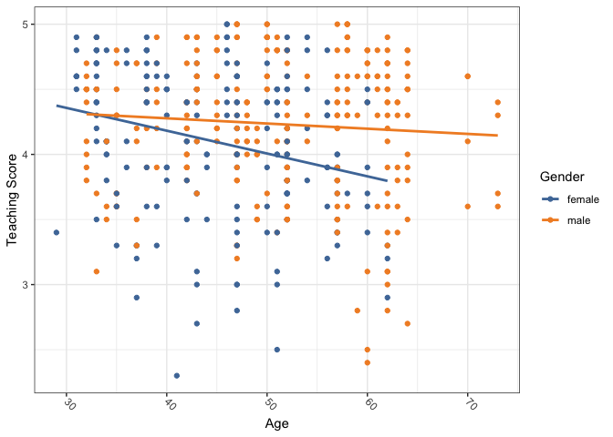

Chapter\_6
================

Code for the Chapter 6 of the [Modern Dive
book](https://moderndive.com/6-regression.html#regression).

``` r
library(tidyverse)
```

    ## ── Attaching packages ─────────────────────────────────────── tidyverse 1.3.1 ──

    ## ✓ ggplot2 3.3.5     ✓ purrr   0.3.4
    ## ✓ tibble  3.1.3     ✓ dplyr   1.0.7
    ## ✓ tidyr   1.1.3     ✓ stringr 1.4.0
    ## ✓ readr   2.0.1     ✓ forcats 0.5.1

    ## ── Conflicts ────────────────────────────────────────── tidyverse_conflicts() ──
    ## x dplyr::filter() masks stats::filter()
    ## x dplyr::lag()    masks stats::lag()

``` r
library(moderndive)
library(skimr)
library(ISLR)
library(ggthemes)
```

Set the palette and the running theme for ggplot2.

``` r
theme_set(theme_bw())
theme_update(axis.text.x = element_text(
angle = -45,
hjust = 0,
vjust = 0.5
))
```

## 6.1

``` r
evals_ch6 <- evals %>%
  select(ID, score, age, gender)

glimpse(evals_ch6)
```

    ## Rows: 463
    ## Columns: 4
    ## $ ID     <int> 1, 2, 3, 4, 5, 6, 7, 8, 9, 10, 11, 12, 13, 14, 15, 16, 17, 18, …
    ## $ score  <dbl> 4.7, 4.1, 3.9, 4.8, 4.6, 4.3, 2.8, 4.1, 3.4, 4.5, 3.8, 4.5, 4.6…
    ## $ age    <int> 36, 36, 36, 36, 59, 59, 59, 51, 51, 40, 40, 40, 40, 40, 40, 40,…
    ## $ gender <fct> female, female, female, female, male, male, male, male, male, f…

``` r
evals_ch6 %>%
  summarise(across(c(age, score),
                   list(mean = mean, median = median)))
```

    ## # A tibble: 1 × 4
    ##   age_mean age_median score_mean score_median
    ##      <dbl>      <int>      <dbl>        <dbl>
    ## 1     48.4         48       4.17          4.3

``` r
evals_ch6 %>%
  skim()
```

|                                                  |            |
|:-------------------------------------------------|:-----------|
| Name                                             | Piped data |
| Number of rows                                   | 463        |
| Number of columns                                | 4          |
| \_\_\_\_\_\_\_\_\_\_\_\_\_\_\_\_\_\_\_\_\_\_\_   |            |
| Column type frequency:                           |            |
| factor                                           | 1          |
| numeric                                          | 3          |
| \_\_\_\_\_\_\_\_\_\_\_\_\_\_\_\_\_\_\_\_\_\_\_\_ |            |
| Group variables                                  | None       |

Data summary

**Variable type: factor**

| skim\_variable | n\_missing | complete\_rate | ordered | n\_unique | top\_counts        |
|:---------------|-----------:|---------------:|:--------|----------:|:-------------------|
| gender         |          0 |              1 | FALSE   |         2 | mal: 268, fem: 195 |

**Variable type: numeric**

| skim\_variable | n\_missing | complete\_rate |   mean |     sd |   p0 |   p25 |   p50 |   p75 | p100 | hist  |
|:---------------|-----------:|---------------:|-------:|-------:|-----:|------:|------:|------:|-----:|:------|
| ID             |          0 |              1 | 232.00 | 133.80 |  1.0 | 116.5 | 232.0 | 347.5 |  463 | ▇▇▇▇▇ |
| score          |          0 |              1 |   4.17 |   0.54 |  2.3 |   3.8 |   4.3 |   4.6 |    5 | ▁▁▅▇▇ |
| age            |          0 |              1 |  48.37 |   9.80 | 29.0 |  42.0 |  48.0 |  57.0 |   73 | ▅▆▇▆▁ |

``` r
evals_ch6 %>%
  get_correlation(score ~ age)
```

    ## # A tibble: 1 × 1
    ##      cor
    ##    <dbl>
    ## 1 -0.107

``` r
evals_ch6 %>%
  ggplot(aes(x = age, 
             y = score,
             color = gender)) +
  geom_point() +
  geom_smooth(method = "lm", se = FALSE) +
  scale_color_tableau(name = "Gender") +
  labs(x = "Age",
       y = "Teaching Score")
```

    ## `geom_smooth()` using formula 'y ~ x'

<!-- -->

``` r
score_model_interaction <- lm(score ~ age * gender, data = evals_ch6)

get_regression_table(score_model_interaction)
```

    ## # A tibble: 4 × 7
    ##   term           estimate std_error statistic p_value lower_ci upper_ci
    ##   <chr>             <dbl>     <dbl>     <dbl>   <dbl>    <dbl>    <dbl>
    ## 1 intercept         4.88      0.205     23.8    0        4.48     5.29 
    ## 2 age              -0.018     0.004     -3.92   0       -0.026   -0.009
    ## 3 gender: male     -0.446     0.265     -1.68   0.094   -0.968    0.076
    ## 4 age:gendermale    0.014     0.006      2.45   0.015    0.003    0.024

Document the information about the analysis session

``` r
sessionInfo()
```

    ## R version 4.1.1 (2021-08-10)
    ## Platform: x86_64-apple-darwin17.0 (64-bit)
    ## Running under: macOS Big Sur 10.16
    ## 
    ## Matrix products: default
    ## BLAS:   /Library/Frameworks/R.framework/Versions/4.1/Resources/lib/libRblas.0.dylib
    ## LAPACK: /Library/Frameworks/R.framework/Versions/4.1/Resources/lib/libRlapack.dylib
    ## 
    ## locale:
    ## [1] en_US.UTF-8/en_US.UTF-8/en_US.UTF-8/C/en_US.UTF-8/en_US.UTF-8
    ## 
    ## attached base packages:
    ## [1] stats     graphics  grDevices datasets  utils     methods   base     
    ## 
    ## other attached packages:
    ##  [1] ggthemes_4.2.4   ISLR_1.2         skimr_2.1.3      moderndive_0.5.2
    ##  [5] forcats_0.5.1    stringr_1.4.0    dplyr_1.0.7      purrr_0.3.4     
    ##  [9] readr_2.0.1      tidyr_1.1.3      tibble_3.1.3     ggplot2_3.3.5   
    ## [13] tidyverse_1.3.1 
    ## 
    ## loaded via a namespace (and not attached):
    ##  [1] httr_1.4.2           jsonlite_1.7.2       splines_4.1.1       
    ##  [4] modelr_0.1.8         assertthat_0.2.1     highr_0.9           
    ##  [7] renv_0.14.0          cellranger_1.1.0     yaml_2.2.1          
    ## [10] pillar_1.6.2         backports_1.2.1      lattice_0.20-44     
    ## [13] glue_1.4.2           digest_0.6.27        rvest_1.0.1         
    ## [16] snakecase_0.11.0     colorspace_2.0-2     htmltools_0.5.1.1   
    ## [19] Matrix_1.3-4         infer_1.0.0          pkgconfig_2.0.3     
    ## [22] broom_0.7.9          haven_2.4.3          scales_1.1.1        
    ## [25] tzdb_0.1.2           mgcv_1.8-36          farver_2.1.0        
    ## [28] generics_0.1.0       ellipsis_0.3.2       withr_2.4.2         
    ## [31] janitor_2.1.0        repr_1.1.3           formula.tools_1.7.1 
    ## [34] cli_3.0.1            magrittr_2.0.1       crayon_1.4.1        
    ## [37] readxl_1.3.1         evaluate_0.14        fs_1.5.0            
    ## [40] fansi_0.5.0          operator.tools_1.6.3 nlme_3.1-152        
    ## [43] xml2_1.3.2           tools_4.1.1          hms_1.1.0           
    ## [46] lifecycle_1.0.0      munsell_0.5.0        reprex_2.0.1        
    ## [49] compiler_4.1.1       rlang_0.4.11         grid_4.1.1          
    ## [52] rstudioapi_0.13      base64enc_0.1-3      labeling_0.4.2      
    ## [55] rmarkdown_2.10       gtable_0.3.0         DBI_1.1.1           
    ## [58] R6_2.5.0             lubridate_1.7.10     knitr_1.33          
    ## [61] utf8_1.2.2           stringi_1.7.3        Rcpp_1.0.7          
    ## [64] vctrs_0.3.8          dbplyr_2.1.1         tidyselect_1.1.1    
    ## [67] xfun_0.25
