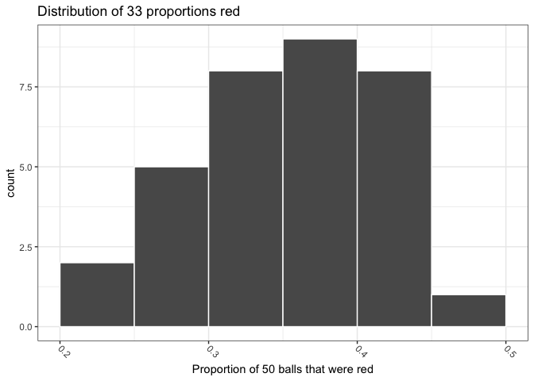
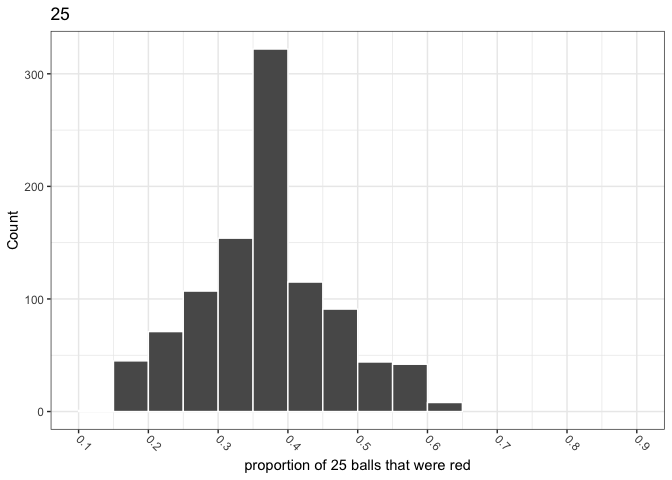
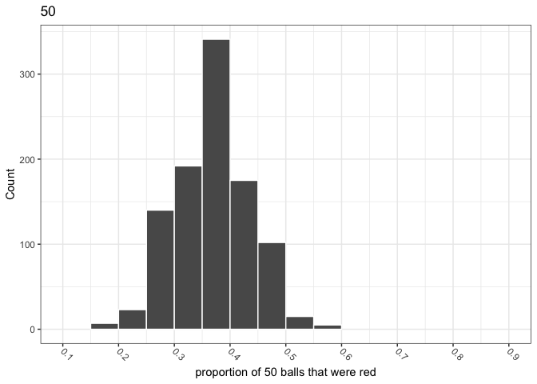
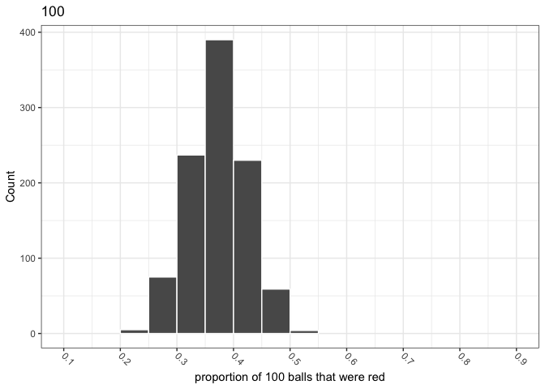

Chapter\_7
================

Code for the Chapter 7 of the [Modern Dive
book](https://moderndive.com/7-sampling.html).

``` r
library(tidyverse)
```

    ## ── Attaching packages ─────────────────────────────────────── tidyverse 1.3.1 ──

    ## ✓ ggplot2 3.3.5     ✓ purrr   0.3.4
    ## ✓ tibble  3.1.3     ✓ dplyr   1.0.7
    ## ✓ tidyr   1.1.3     ✓ stringr 1.4.0
    ## ✓ readr   2.0.1     ✓ forcats 0.5.1

    ## ── Conflicts ────────────────────────────────────────── tidyverse_conflicts() ──
    ## x dplyr::filter() masks stats::filter()
    ## x dplyr::lag()    masks stats::lag()

``` r
library(glue)
```

    ## 
    ## Attaching package: 'glue'

    ## The following object is masked from 'package:dplyr':
    ## 
    ##     collapse

``` r
library(moderndive)
library(ggthemes)
```

Set the palette and the running theme for ggplot2.

``` r
theme_set(theme_bw())
theme_update(axis.text.x = element_text(
angle = -45,
hjust = 0,
vjust = 0.5
))
```

### 7.1.3

``` r
tactile_prop_red
```

    ## # A tibble: 33 × 4
    ##    group            replicate red_balls prop_red
    ##    <chr>                <int>     <int>    <dbl>
    ##  1 Ilyas, Yohan             1        21     0.42
    ##  2 Morgan, Terrance         2        17     0.34
    ##  3 Martin, Thomas           3        21     0.42
    ##  4 Clark, Frank             4        21     0.42
    ##  5 Riddhi, Karina           5        18     0.36
    ##  6 Andrew, Tyler            6        19     0.38
    ##  7 Julia                    7        19     0.38
    ##  8 Rachel, Lauren           8        11     0.22
    ##  9 Daniel, Caroline         9        15     0.3 
    ## 10 Josh, Maeve             10        17     0.34
    ## # … with 23 more rows

``` r
ggplot(tactile_prop_red, aes(x = prop_red)) +
  geom_histogram(binwidth = 0.05,
                 boundary = 0.4,
                 color = "white") +
  labs(x = "Proportion of 50 balls that were red",
       title = "Distribution of 33 proportions red")
```

<!-- -->

``` r
glimpse(bowl)
```

    ## Rows: 2,400
    ## Columns: 2
    ## $ ball_ID <int> 1, 2, 3, 4, 5, 6, 7, 8, 9, 10, 11, 12, 13, 14, 15, 16, 17, 18,…
    ## $ color   <chr> "white", "white", "white", "red", "white", "white", "red", "wh…

``` r
plot_red_prop <- function(sample_size) {
  bowl %>%
    rep_sample_n(sample_size, 1000, replace = T) %>%
    group_by(replicate) %>%
    summarise(prop_red = mean(color == "red")) %>%
    ggplot(aes(x = prop_red)) +
    geom_histogram(binwidth = 0.05,
                   boundary = 0.4,
                   color = "white") +
    scale_x_continuous(breaks = seq(0.1, 0.9, 0.1)) +
    coord_cartesian(xlim = c(0.1, 0.9)) +
    labs(x = glue("proportion of {sample_size} balls that were red"),
         y = "Count",
         title = glue("{sample_size}"))
}
```

``` r
set.seed(1942)

sample_sizes <- c(25, 50, 100)

  map(sample_sizes, ~ plot_red_prop(.x))
```

    ## [[1]]

<!-- -->

    ## 
    ## [[2]]

<!-- -->

    ## 
    ## [[3]]

<!-- -->

``` r
calc_red_prop_sd <- function(sample_size) {
  bowl %>%
    rep_sample_n(sample_size, 1000, replace = T) %>%
    group_by(replicate) %>%
    summarise(prop_red = mean(color == "red")) %>%
    ungroup() %>%
    summarise(sd = sd(prop_red))
}
```

``` r
map_df(sample_sizes, ~calc_red_prop_sd(.x))
```

    ## # A tibble: 3 × 1
    ##       sd
    ##    <dbl>
    ## 1 0.0965
    ## 2 0.0681
    ## 3 0.0477

## 7.3

Document the information about the analysis session

``` r
sessionInfo()
```

    ## R version 4.1.1 (2021-08-10)
    ## Platform: x86_64-apple-darwin17.0 (64-bit)
    ## Running under: macOS Big Sur 10.16
    ## 
    ## Matrix products: default
    ## BLAS:   /Library/Frameworks/R.framework/Versions/4.1/Resources/lib/libRblas.0.dylib
    ## LAPACK: /Library/Frameworks/R.framework/Versions/4.1/Resources/lib/libRlapack.dylib
    ## 
    ## locale:
    ## [1] en_US.UTF-8/en_US.UTF-8/en_US.UTF-8/C/en_US.UTF-8/en_US.UTF-8
    ## 
    ## attached base packages:
    ## [1] stats     graphics  grDevices datasets  utils     methods   base     
    ## 
    ## other attached packages:
    ##  [1] ggthemes_4.2.4   moderndive_0.5.2 glue_1.4.2       forcats_0.5.1   
    ##  [5] stringr_1.4.0    dplyr_1.0.7      purrr_0.3.4      readr_2.0.1     
    ##  [9] tidyr_1.1.3      tibble_3.1.3     ggplot2_3.3.5    tidyverse_1.3.1 
    ## 
    ## loaded via a namespace (and not attached):
    ##  [1] Rcpp_1.0.7           lubridate_1.7.10     formula.tools_1.7.1 
    ##  [4] assertthat_0.2.1     digest_0.6.27        utf8_1.2.2          
    ##  [7] R6_2.5.1             cellranger_1.1.0     backports_1.2.1     
    ## [10] reprex_2.0.1         evaluate_0.14        highr_0.9           
    ## [13] httr_1.4.2           pillar_1.6.2         rlang_0.4.11        
    ## [16] readxl_1.3.1         rstudioapi_0.13      rmarkdown_2.10      
    ## [19] labeling_0.4.2       munsell_0.5.0        broom_0.7.9         
    ## [22] compiler_4.1.1       modelr_0.1.8         janitor_2.1.0       
    ## [25] xfun_0.25            pkgconfig_2.0.3      htmltools_0.5.1.1   
    ## [28] tidyselect_1.1.1     fansi_0.5.0          crayon_1.4.1        
    ## [31] tzdb_0.1.2           dbplyr_2.1.1         withr_2.4.2         
    ## [34] grid_4.1.1           jsonlite_1.7.2       gtable_0.3.0        
    ## [37] lifecycle_1.0.0      DBI_1.1.1            magrittr_2.0.1      
    ## [40] infer_1.0.0          scales_1.1.1         cli_3.0.1           
    ## [43] stringi_1.7.3        farver_2.1.0         renv_0.14.0         
    ## [46] fs_1.5.0             snakecase_0.11.0     xml2_1.3.2          
    ## [49] ellipsis_0.3.2       generics_0.1.0       vctrs_0.3.8         
    ## [52] tools_4.1.1          hms_1.1.0            yaml_2.2.1          
    ## [55] colorspace_2.0-2     operator.tools_1.6.3 rvest_1.0.1         
    ## [58] knitr_1.33           haven_2.4.3
