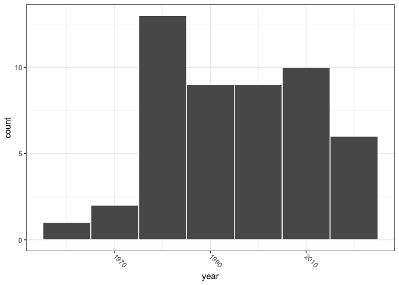
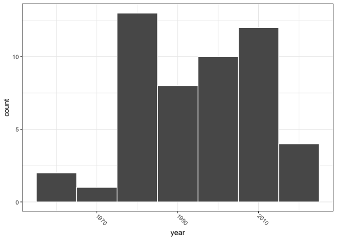
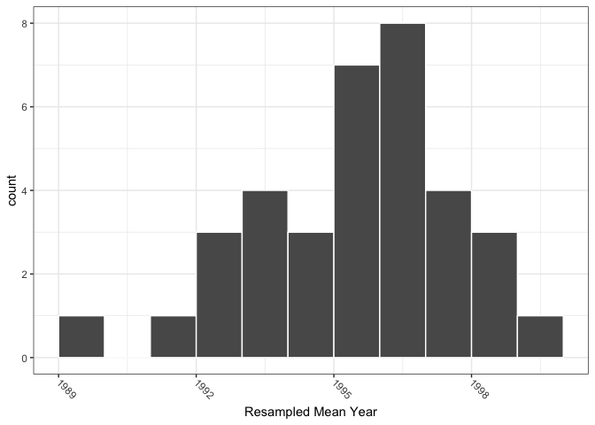
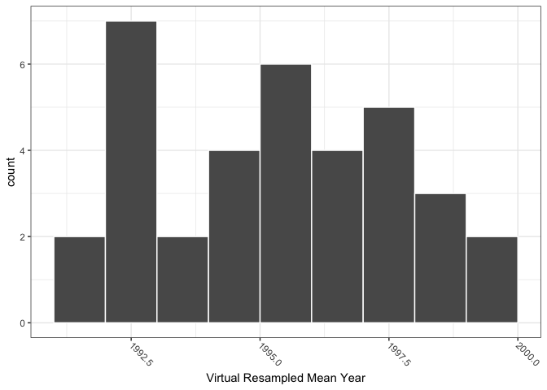
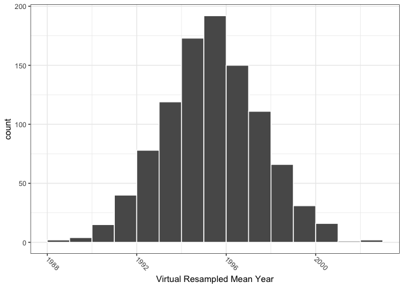
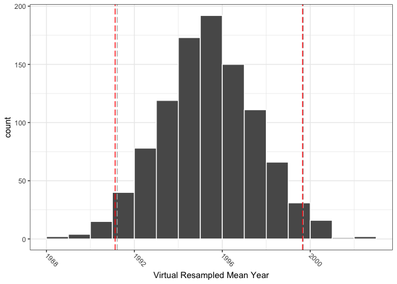
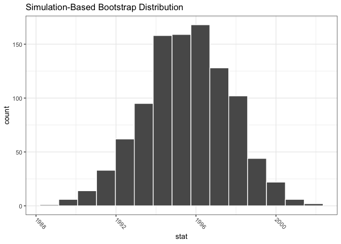
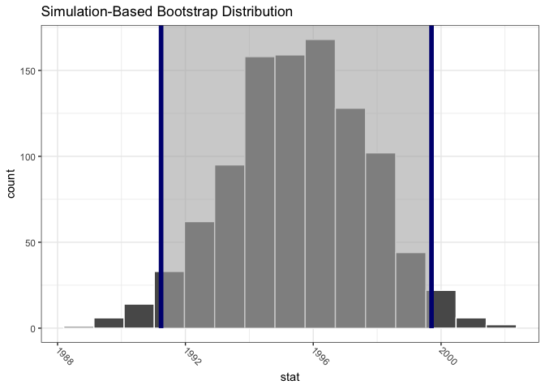
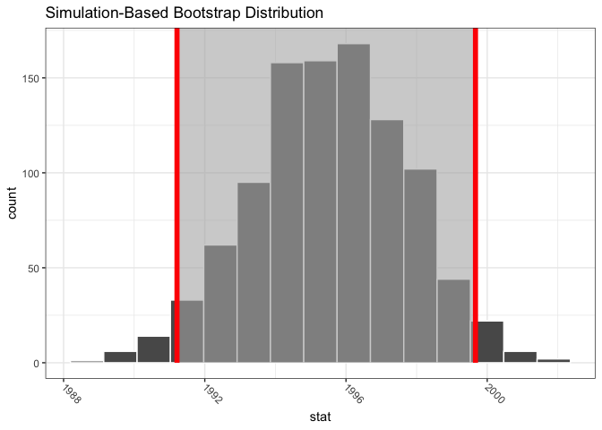
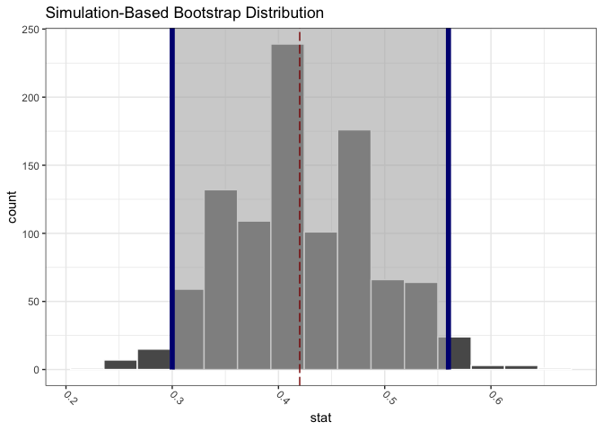

Chapter\_8
================

Code for the Chapter 8 of the [Modern Dive
book](https://moderndive.com/8-confidence-intervals.html).

``` r
library(tidyverse)
```

    ## ── Attaching packages ─────────────────────────────────────── tidyverse 1.3.1 ──

    ## ✓ ggplot2 3.3.5     ✓ purrr   0.3.4
    ## ✓ tibble  3.1.3     ✓ dplyr   1.0.7
    ## ✓ tidyr   1.1.3     ✓ stringr 1.4.0
    ## ✓ readr   2.0.1     ✓ forcats 0.5.1

    ## ── Conflicts ────────────────────────────────────────── tidyverse_conflicts() ──
    ## x dplyr::filter() masks stats::filter()
    ## x dplyr::lag()    masks stats::lag()

``` r
library(moderndive)
library(infer)
library(ggthemes)
```

Set the palette and the running theme for ggplot2.

``` r
theme_set(theme_bw())
theme_update(axis.text.x = element_text(
angle = -45,
hjust = 0,
vjust = 0.5
))
```

## 8,.1

### 8.1.1

``` r
glimpse(pennies_sample)
```

    ## Rows: 50
    ## Columns: 2
    ## $ ID   <int> 1, 2, 3, 4, 5, 6, 7, 8, 9, 10, 11, 12, 13, 14, 15, 16, 17, 18, 19…
    ## $ year <dbl> 2002, 1986, 2017, 1988, 2008, 1983, 2008, 1996, 2004, 2000, 1994,…

``` r
pennies_sample %>%
  ggplot(aes(x = year)) +
  geom_histogram(binwidth = 10,
                 color = "white")
```

<!-- -->

``` r
x_bar <- pennies_sample %>%
  summarise(mean_year = mean(year))

x_bar
```

    ## # A tibble: 1 × 1
    ##   mean_year
    ##       <dbl>
    ## 1     1995.

### 8.1.2

``` r
pennies_resample <- tibble(
  year = c(1976, 1962, 1976, 1983, 2017, 2015, 2015, 1962, 2016, 1976, 
           2006, 1997, 1988, 2015, 2015, 1988, 2016, 1978, 1979, 1997, 
           1974, 2013, 1978, 2015, 2008, 1982, 1986, 1979, 1981, 2004, 
           2000, 1995, 1999, 2006, 1979, 2015, 1979, 1998, 1981, 2015, 
           2000, 1999, 1988, 2017, 1992, 1997, 1990, 1988, 2006, 2000)
)
```

``` r
pennies_resample %>%
  ggplot(aes(x = year)) +
  geom_histogram(binwidth = 10,
                 color = "white")
```

<!-- -->

``` r
pennies_resample %>%
  summarise(mean_year = mean(year))
```

    ## # A tibble: 1 × 1
    ##   mean_year
    ##       <dbl>
    ## 1     1995.

``` r
glimpse(pennies_resamples)
```

    ## Rows: 1,750
    ## Columns: 3
    ## Groups: name [35]
    ## $ replicate <int> 1, 1, 1, 1, 1, 1, 1, 1, 1, 1, 1, 1, 1, 1, 1, 1, 1, 1, 1, 1, …
    ## $ name      <chr> "Arianna", "Arianna", "Arianna", "Arianna", "Arianna", "Aria…
    ## $ year      <dbl> 1988, 2002, 2015, 1998, 1979, 1971, 1971, 2015, 1988, 1979, …

``` r
resampled_means <- pennies_resamples %>%
  group_by(name) %>%
  summarise(mean_year = mean(year))

resampled_means
```

    ## # A tibble: 35 × 2
    ##    name      mean_year
    ##    <chr>         <dbl>
    ##  1 Arianna       1992.
    ##  2 Artemis       1996.
    ##  3 Bea           1996.
    ##  4 Camryn        1997.
    ##  5 Cassandra     1991.
    ##  6 Cindy         1995.
    ##  7 Claire        1996.
    ##  8 Dahlia        1998.
    ##  9 Dan           1994.
    ## 10 Eindra        1994.
    ## # … with 25 more rows

``` r
resampled_means %>%
  ggplot(aes(x = mean_year)) +
  geom_histogram(binwidth = 1,
                 boundary = 1990,
                 color = "white") +
  labs(x = "Resampled Mean Year")
```

<!-- -->

## 8.2

### 8.1

``` r
set.seed(42)

virtual_resample <- pennies_sample %>%
  rep_sample_n(size = 50, replace = TRUE)

virtual_resample
```

    ## # A tibble: 50 × 3
    ## # Groups:   replicate [1]
    ##    replicate    ID  year
    ##        <int> <int> <dbl>
    ##  1         1    49  2006
    ##  2         1    37  1962
    ##  3         1     1  2002
    ##  4         1    25  1979
    ##  5         1    10  2000
    ##  6         1    36  2015
    ##  7         1    18  1996
    ##  8         1    49  2006
    ##  9         1    47  1982
    ## 10         1    24  2017
    ## # … with 40 more rows

``` r
virtual_resample %>%
  summarise(resample_mean = mean(year))
```

    ## # A tibble: 1 × 2
    ##   replicate resample_mean
    ##       <int>         <dbl>
    ## 1         1         1995.

``` r
virtual_resamples <- pennies_sample %>%
  rep_sample_n(size = 50, 
               replace = TRUE,
               reps = 35)

virtual_resamples
```

    ## # A tibble: 1,750 × 3
    ## # Groups:   replicate [35]
    ##    replicate    ID  year
    ##        <int> <int> <dbl>
    ##  1         1    50  2017
    ##  2         1    35  1985
    ##  3         1    24  2017
    ##  4         1    23  1998
    ##  5         1    49  2006
    ##  6         1    26  1979
    ##  7         1    50  2017
    ##  8         1     6  1983
    ##  9         1     6  1983
    ## 10         1     2  1986
    ## # … with 1,740 more rows

``` r
virtual_resampled_means <- virtual_resamples %>%
  group_by(replicate) %>%
  summarise(mean_year = mean(year))

virtual_resampled_means
```

    ## # A tibble: 35 × 2
    ##    replicate mean_year
    ##        <int>     <dbl>
    ##  1         1     1999.
    ##  2         2     1996.
    ##  3         3     1993.
    ##  4         4     1995.
    ##  5         5     1993.
    ##  6         6     1996.
    ##  7         7     1995.
    ##  8         8     1996.
    ##  9         9     1998.
    ## 10        10     1995.
    ## # … with 25 more rows

``` r
virtual_resampled_means %>%
  ggplot(aes(x = mean_year)) +
  geom_histogram(binwidth = 1,
                 boundary = 1990,
                 color = "white") +
  labs(x = "Virtual Resampled Mean Year")
```

<!-- -->

``` r
virtual_resampled_means <- pennies_sample %>%
  rep_sample_n(size = 50, 
               replace = TRUE,
               reps = 1000) %>%
  group_by(replicate) %>%
  summarise(mean_year = mean(year))

virtual_resampled_means
```

    ## # A tibble: 1,000 × 2
    ##    replicate mean_year
    ##        <int>     <dbl>
    ##  1         1     1996.
    ##  2         2     1999.
    ##  3         3     1994.
    ##  4         4     1998.
    ##  5         5     1995.
    ##  6         6     1992 
    ##  7         7     1993.
    ##  8         8     1994.
    ##  9         9     1993.
    ## 10        10     1994.
    ## # … with 990 more rows

``` r
virtual_resampled_means %>%
  ggplot(aes(x = mean_year)) +
  geom_histogram(binwidth = 1,
                 boundary = 1990,
                 color = "white") +
  labs(x = "Virtual Resampled Mean Year")
```

<!-- -->

## 8.3

### 8.3.1

``` r
CI95_q <- quantile(virtual_resampled_means$mean_year,c(0.025, 0.975))

CI95_q
```

    ##     2.5%    97.5% 
    ## 1991.219 1999.683

``` r
virtual_resampled_means %>%
  ggplot(aes(x = mean_year)) +
  geom_histogram(binwidth = 1,
                 boundary = 1990,
                 color = "white") +
  geom_vline(xintercept = CI95_q,
             linetype = "longdash",
             color = "grey70") +
  
  labs(x = "Virtual Resampled Mean Year")
```

<!-- -->

``` r
CI95_n <- virtual_resampled_means %>%
  summarise(means_of_means = mean(mean_year),
            sd_of_mean = sd(mean_year)) %>%
  mutate(CI95_low = means_of_means - 1.96 * sd_of_mean,
         CI95_high = means_of_means + 1.96 * sd_of_mean) %>%
  select(CI95_low, CI95_high) %>%
  pivot_longer(cols = c(CI95_low, CI95_high)) %>%
  pull(value)

CI95_n
```

    ## [1] 1991.124 1999.651

``` r
virtual_resampled_means %>%
  ggplot(aes(x = mean_year)) +
  geom_histogram(binwidth = 1,
                 boundary = 1990,
                 color = "white") +
  geom_vline(xintercept = CI95_q,
             linetype = "longdash",
             color = "grey70") +
  geom_vline(xintercept = CI95_n,
             linetype = "longdash",
             color = "red") +
  
  labs(x = "Virtual Resampled Mean Year")
```

<!-- -->

## 8.4

### 8.4.2

``` r
pennies_sample %>%
  summarize(stat = mean(year))
```

    ## # A tibble: 1 × 1
    ##    stat
    ##   <dbl>
    ## 1 1995.

``` r
pennies_sample %>%
  specify(response = year) %>%
  calculate(stat = "mean")
```

    ## Response: year (numeric)
    ## # A tibble: 1 × 1
    ##    stat
    ##   <dbl>
    ## 1 1995.

``` r
pennies_sample %>%
  specify(response = year)
```

    ## Response: year (numeric)
    ## # A tibble: 50 × 1
    ##     year
    ##    <dbl>
    ##  1  2002
    ##  2  1986
    ##  3  2017
    ##  4  1988
    ##  5  2008
    ##  6  1983
    ##  7  2008
    ##  8  1996
    ##  9  2004
    ## 10  2000
    ## # … with 40 more rows

``` r
pennies_sample %>%
  specify(formula = year ~ NULL)
```

    ## Response: year (numeric)
    ## # A tibble: 50 × 1
    ##     year
    ##    <dbl>
    ##  1  2002
    ##  2  1986
    ##  3  2017
    ##  4  1988
    ##  5  2008
    ##  6  1983
    ##  7  2008
    ##  8  1996
    ##  9  2004
    ## 10  2000
    ## # … with 40 more rows

``` r
pennies_sample %>%
  specify(formula = year ~ NULL) %>%
  generate(reps = 1000, type = "bootstrap")
```

    ## Response: year (numeric)
    ## # A tibble: 50,000 × 2
    ## # Groups:   replicate [1,000]
    ##    replicate  year
    ##        <int> <dbl>
    ##  1         1  1978
    ##  2         1  1995
    ##  3         1  1992
    ##  4         1  1979
    ##  5         1  1986
    ##  6         1  2013
    ##  7         1  1992
    ##  8         1  2015
    ##  9         1  1976
    ## 10         1  2017
    ## # … with 49,990 more rows

``` r
bootstrap_distr <- pennies_sample %>%
  specify(formula = year ~ NULL) %>%
  generate(reps = 1000) %>%
  calculate(stat = "mean")
```

    ## Setting `type = "bootstrap"` in `generate()`.

``` r
bootstrap_distr
```

    ## Response: year (numeric)
    ## # A tibble: 1,000 × 2
    ##    replicate  stat
    ##        <int> <dbl>
    ##  1         1 1997.
    ##  2         2 1997.
    ##  3         3 1996.
    ##  4         4 1997.
    ##  5         5 1993.
    ##  6         6 1999.
    ##  7         7 1994.
    ##  8         8 1997.
    ##  9         9 1993.
    ## 10        10 1995.
    ## # … with 990 more rows

``` r
visualize(bootstrap_distr)
```

<!-- -->

### 8.4.3

``` r
percentile_ci <- bootstrap_distr %>%
  get_confidence_interval(level = 0.95, type = "percentile")

percentile_ci
```

    ## # A tibble: 1 × 2
    ##   lower_ci upper_ci
    ##      <dbl>    <dbl>
    ## 1    1991.    2000.

``` r
visualize(bootstrap_distr) +
  shade_confidence_interval(endpoints = percentile_ci,
                            color = "navyblue",
                            fill = "gray70")
```

<!-- -->

### 8.4.4

``` r
standard_error_ci <- bootstrap_distr %>%
  get_confidence_interval(type = "se", point_estimate = x_bar)
```

    ## Using `level = 0.95` to compute confidence interval.

``` r
standard_error_ci
```

    ## # A tibble: 1 × 2
    ##   lower_ci upper_ci
    ##      <dbl>    <dbl>
    ## 1    1991.    2000.

``` r
visualize(bootstrap_distr) +
  shade_confidence_interval(endpoints = standard_error_ci,
                            color = "red",
                            fill = "gray70")
```

<!-- -->

## 8.5

``` r
bowl %>%
  summarize(p_red = mean(color == "red"))
```

    ## # A tibble: 1 × 1
    ##   p_red
    ##   <dbl>
    ## 1 0.375

``` r
bowl_sample_1
```

    ## # A tibble: 50 × 1
    ##    color
    ##    <chr>
    ##  1 white
    ##  2 white
    ##  3 red  
    ##  4 red  
    ##  5 white
    ##  6 white
    ##  7 red  
    ##  8 white
    ##  9 white
    ## 10 white
    ## # … with 40 more rows

``` r
p_hat <- bowl_sample_1 %>% 
  summarise(prop = mean(color == "red")) %>%
  pull(prop)

p_hat
```

    ## [1] 0.42

``` r
bowl_sample_1 %>%
  specify(response = color, success = "red")
```

    ## Response: color (factor)
    ## # A tibble: 50 × 1
    ##    color
    ##    <fct>
    ##  1 white
    ##  2 white
    ##  3 red  
    ##  4 red  
    ##  5 white
    ##  6 white
    ##  7 red  
    ##  8 white
    ##  9 white
    ## 10 white
    ## # … with 40 more rows

``` r
bowl_sample_1 %>%
  specify(response = color, success = "red") %>%
  generate(reps = 1000, type = "bootstrap")
```

    ## Response: color (factor)
    ## # A tibble: 50,000 × 2
    ## # Groups:   replicate [1,000]
    ##    replicate color
    ##        <int> <fct>
    ##  1         1 white
    ##  2         1 white
    ##  3         1 white
    ##  4         1 red  
    ##  5         1 white
    ##  6         1 white
    ##  7         1 white
    ##  8         1 red  
    ##  9         1 red  
    ## 10         1 white
    ## # … with 49,990 more rows

``` r
sample_1_bootstrap <- bowl_sample_1 %>%
  specify(response = color, success = "red") %>%
  generate(reps = 1000, type = "bootstrap") %>%
  calculate(stat = "prop")
```

``` r
percentile_ci_1 <- sample_1_bootstrap %>%
  get_ci(level = 0.95, type = "percentile")

percentile_ci_1
```

    ## # A tibble: 1 × 2
    ##   lower_ci upper_ci
    ##      <dbl>    <dbl>
    ## 1      0.3     0.56

``` r
sample_1_bootstrap %>%
  visualize(bins = 15) +
  shade_ci(endpoints = percentile_ci_1,
           color = "navyblue",
           fill = "grey70") +
  geom_vline(xintercept = p_hat,
             linetype = "longdash",
             color = "darkred")
```

<!-- -->

``` r
bowl_sample_2 <- bowl %>%
  rep_sample_n(size = 50)

bowl_sample_2
```

    ## # A tibble: 50 × 3
    ## # Groups:   replicate [1]
    ##    replicate ball_ID color
    ##        <int>   <int> <chr>
    ##  1         1    1423 white
    ##  2         1    1193 white
    ##  3         1    1283 red  
    ##  4         1    2186 red  
    ##  5         1    2095 white
    ##  6         1     357 red  
    ##  7         1    1320 white
    ##  8         1    1084 white
    ##  9         1    2100 red  
    ## 10         1     267 white
    ## # … with 40 more rows

``` r
sample_2_bootstrap <- bowl_sample_2 %>%
  specify(response = color, success = "red") %>%
  generate(reps = 1000, type = "bootstrap") %>%
  calculate(stat = "prop")

sample_2_bootstrap
```

    ## Response: color (factor)
    ## # A tibble: 1,000 × 2
    ##    replicate  stat
    ##        <int> <dbl>
    ##  1         1  0.3 
    ##  2         2  0.44
    ##  3         3  0.28
    ##  4         4  0.4 
    ##  5         5  0.32
    ##  6         6  0.26
    ##  7         7  0.4 
    ##  8         8  0.42
    ##  9         9  0.46
    ## 10        10  0.34
    ## # … with 990 more rows

``` r
percentile_ci_2 <- sample_2_bootstrap %>%
  get_ci(level = 0.95, type = "percentile")

percentile_ci_2
```

    ## # A tibble: 1 × 2
    ##   lower_ci upper_ci
    ##      <dbl>    <dbl>
    ## 1      0.2     0.46

Document the information about the analysis session

``` r
sessionInfo()
```

    ## R version 4.1.1 (2021-08-10)
    ## Platform: x86_64-apple-darwin17.0 (64-bit)
    ## Running under: macOS Big Sur 10.16
    ## 
    ## Matrix products: default
    ## BLAS:   /Library/Frameworks/R.framework/Versions/4.1/Resources/lib/libRblas.0.dylib
    ## LAPACK: /Library/Frameworks/R.framework/Versions/4.1/Resources/lib/libRlapack.dylib
    ## 
    ## locale:
    ## [1] en_US.UTF-8/en_US.UTF-8/en_US.UTF-8/C/en_US.UTF-8/en_US.UTF-8
    ## 
    ## attached base packages:
    ## [1] stats     graphics  grDevices datasets  utils     methods   base     
    ## 
    ## other attached packages:
    ##  [1] ggthemes_4.2.4   infer_1.0.0      moderndive_0.5.2 forcats_0.5.1   
    ##  [5] stringr_1.4.0    dplyr_1.0.7      purrr_0.3.4      readr_2.0.1     
    ##  [9] tidyr_1.1.3      tibble_3.1.3     ggplot2_3.3.5    tidyverse_1.3.1 
    ## 
    ## loaded via a namespace (and not attached):
    ##  [1] Rcpp_1.0.7           lubridate_1.7.10     formula.tools_1.7.1 
    ##  [4] assertthat_0.2.1     digest_0.6.27        utf8_1.2.2          
    ##  [7] R6_2.5.1             cellranger_1.1.0     backports_1.2.1     
    ## [10] reprex_2.0.1         evaluate_0.14        highr_0.9           
    ## [13] httr_1.4.2           pillar_1.6.2         rlang_0.4.11        
    ## [16] readxl_1.3.1         rstudioapi_0.13      rmarkdown_2.10      
    ## [19] labeling_0.4.2       munsell_0.5.0        broom_0.7.9         
    ## [22] compiler_4.1.1       modelr_0.1.8         janitor_2.1.0       
    ## [25] xfun_0.25            pkgconfig_2.0.3      htmltools_0.5.1.1   
    ## [28] tidyselect_1.1.1     fansi_0.5.0          crayon_1.4.1        
    ## [31] tzdb_0.1.2           dbplyr_2.1.1         withr_2.4.2         
    ## [34] grid_4.1.1           jsonlite_1.7.2       gtable_0.3.0        
    ## [37] lifecycle_1.0.0      DBI_1.1.1            magrittr_2.0.1      
    ## [40] scales_1.1.1         cli_3.0.1            stringi_1.7.3       
    ## [43] farver_2.1.0         renv_0.14.0          fs_1.5.0            
    ## [46] snakecase_0.11.0     xml2_1.3.2           ellipsis_0.3.2      
    ## [49] generics_0.1.0       vctrs_0.3.8          tools_4.1.1         
    ## [52] glue_1.4.2           hms_1.1.0            yaml_2.2.1          
    ## [55] colorspace_2.0-2     operator.tools_1.6.3 rvest_1.0.1         
    ## [58] knitr_1.33           haven_2.4.3
