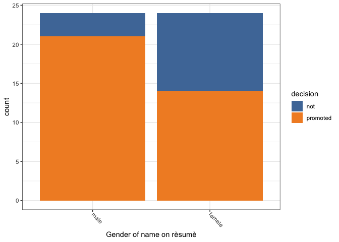
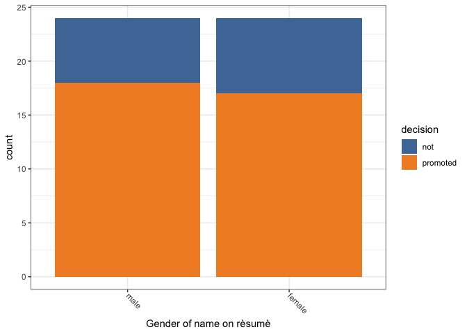
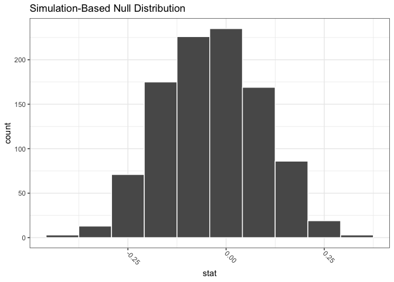
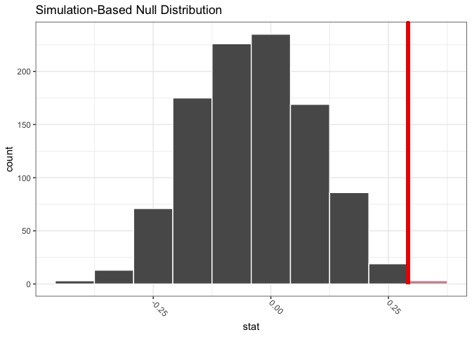
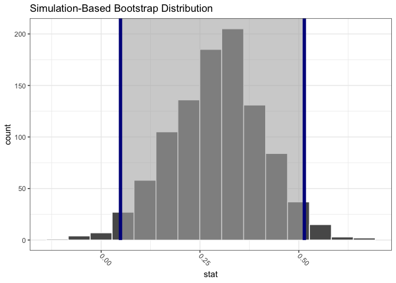
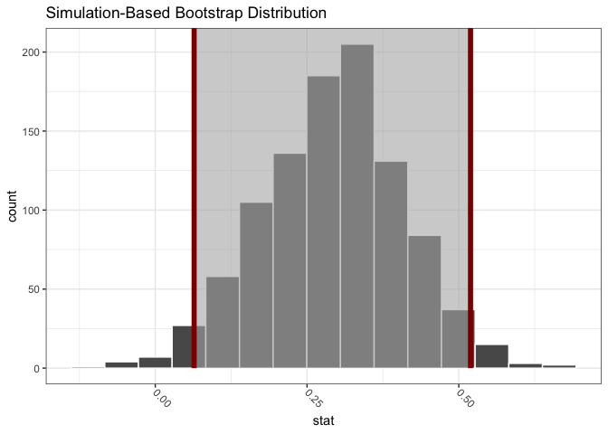

Chapter\_9
================

Code for the Chapter 9 of the [Modern Dive
book](https://moderndive.com/9-hypothesis-testing.html).

``` r
library(tidyverse)
```

    ## ── Attaching packages ─────────────────────────────────────── tidyverse 1.3.1 ──

    ## ✓ ggplot2 3.3.5     ✓ purrr   0.3.4
    ## ✓ tibble  3.1.3     ✓ dplyr   1.0.7
    ## ✓ tidyr   1.1.3     ✓ stringr 1.4.0
    ## ✓ readr   2.0.1     ✓ forcats 0.5.1

    ## ── Conflicts ────────────────────────────────────────── tidyverse_conflicts() ──
    ## x dplyr::filter() masks stats::filter()
    ## x dplyr::lag()    masks stats::lag()

``` r
library(infer)
library(moderndive)
library(nycflights13)
library(ggplot2movies)
library(ggthemes)
```

Set the palette and the running theme for ggplot2.

``` r
theme_set(theme_bw())
theme_update(axis.text.x = element_text(
angle = -45,
hjust = 0,
vjust = 0.5
))
```

## 9.1

### 9.1.1

``` r
set.seed(42)

promotions %>%
  sample_n(size = 6) %>%
  arrange(id)
```

    ## # A tibble: 6 × 3
    ##      id decision gender
    ##   <int> <fct>    <fct> 
    ## 1     1 promoted male  
    ## 2    10 promoted male  
    ## 3    18 promoted male  
    ## 4    25 promoted female
    ## 5    36 not      male  
    ## 6    37 not      male

``` r
promotions %>%
  ggplot(aes(x = gender,
             fill = decision)) +
  geom_bar() +
  scale_fill_tableau() +
  labs(x = "Gender of name on rèsumè") 
```

<!-- -->

``` r
promotions %>%
  count(gender, decision)
```

    ## # A tibble: 4 × 3
    ##   gender decision     n
    ##   <fct>  <fct>    <int>
    ## 1 male   not          3
    ## 2 male   promoted    21
    ## 3 female not         10
    ## 4 female promoted    14

``` r
promotions_shuffled %>%
  ggplot(aes(x = gender,
             fill = decision)) +
  geom_bar() +
  scale_fill_tableau() +
  labs(x = "Gender of name on rèsumè")
```

<!-- -->

``` r
promotions_shuffled %>%
  count(gender, decision)
```

    ## # A tibble: 4 × 3
    ##   gender decision     n
    ##   <fct>  <fct>    <int>
    ## 1 male   not          6
    ## 2 male   promoted    18
    ## 3 female not          7
    ## 4 female promoted    17

## 9.3

### 9.3.1

``` r
promotions %>%
  specify(formula = decision ~ gender,
          success = "promoted")
```

    ## Response: decision (factor)
    ## Explanatory: gender (factor)
    ## # A tibble: 48 × 2
    ##    decision gender
    ##    <fct>    <fct> 
    ##  1 promoted male  
    ##  2 promoted male  
    ##  3 promoted male  
    ##  4 promoted male  
    ##  5 promoted male  
    ##  6 promoted male  
    ##  7 promoted male  
    ##  8 promoted male  
    ##  9 promoted male  
    ## 10 promoted male  
    ## # … with 38 more rows

``` r
promotions %>%
  specify(formula = decision ~ gender,
          success = "promoted") %>%
  hypothesize(null = "independence")
```

    ## Response: decision (factor)
    ## Explanatory: gender (factor)
    ## Null Hypothesis: independence
    ## # A tibble: 48 × 2
    ##    decision gender
    ##    <fct>    <fct> 
    ##  1 promoted male  
    ##  2 promoted male  
    ##  3 promoted male  
    ##  4 promoted male  
    ##  5 promoted male  
    ##  6 promoted male  
    ##  7 promoted male  
    ##  8 promoted male  
    ##  9 promoted male  
    ## 10 promoted male  
    ## # … with 38 more rows

``` r
promotions_generate <- promotions %>%
  specify(formula = decision ~ gender,
          success = "promoted") %>%
  hypothesize(null = "independence") %>%
  generate(reps = 1000, 
           type = "permute")

promotions_generate
```

    ## Response: decision (factor)
    ## Explanatory: gender (factor)
    ## Null Hypothesis: independence
    ## # A tibble: 48,000 × 3
    ## # Groups:   replicate [1,000]
    ##    decision gender replicate
    ##    <fct>    <fct>      <int>
    ##  1 not      male           1
    ##  2 promoted male           1
    ##  3 promoted male           1
    ##  4 not      male           1
    ##  5 promoted male           1
    ##  6 not      male           1
    ##  7 promoted male           1
    ##  8 promoted male           1
    ##  9 promoted male           1
    ## 10 not      male           1
    ## # … with 47,990 more rows

``` r
null_distribution <- promotions %>%
  specify(formula = decision ~ gender,
          success = "promoted") %>%
  hypothesize(null = "independence") %>%
  generate(reps = 1000, 
           type = "permute") %>%
  calculate(stat = "diff in props",
            order = c("male", "female"))

null_distribution
```

    ## Response: decision (factor)
    ## Explanatory: gender (factor)
    ## Null Hypothesis: independence
    ## # A tibble: 1,000 × 2
    ##    replicate    stat
    ##        <int>   <dbl>
    ##  1         1 -0.0417
    ##  2         2  0.0417
    ##  3         3  0.208 
    ##  4         4  0.125 
    ##  5         5  0.125 
    ##  6         6  0.208 
    ##  7         7  0.0417
    ##  8         8 -0.125 
    ##  9         9  0.208 
    ## 10        10 -0.0417
    ## # … with 990 more rows

``` r
obs_diff_prop <- promotions %>%
  specify(formula = decision ~ gender,
          success = "promoted") %>%
  calculate(stat = "diff in props",
            order = c("male", "female"))

obs_diff_prop
```

    ## Response: decision (factor)
    ## Explanatory: gender (factor)
    ## # A tibble: 1 × 1
    ##    stat
    ##   <dbl>
    ## 1 0.292

``` r
visualize(null_distribution, bins = 10)
```

<!-- -->

``` r
visualize(null_distribution, bins = 10) +
  shade_p_value(obs_stat = obs_diff_prop, direction = "right")
```

<!-- -->

``` r
null_distribution %>%
  get_p_value(obs_stat = obs_diff_prop, 
              direction = "right")
```

    ## # A tibble: 1 × 1
    ##   p_value
    ##     <dbl>
    ## 1   0.022

### 9.3.2

``` r
bootstrap_distribution <- promotions %>%
  specify(formula = decision ~ gender,
          success = "promoted") %>%
  # Remove hypothesize()
  #hypothesize(null = "independence") %>%
  # Change type from "permute" to "bootstrap"
  generate(reps = 1000, 
           type = "bootstrap") %>%
  calculate(stat = "diff in props",
            order = c("male", "female"))

bootstrap_distribution
```

    ## Response: decision (factor)
    ## Explanatory: gender (factor)
    ## # A tibble: 1,000 × 2
    ##    replicate     stat
    ##        <int>    <dbl>
    ##  1         1  0.236  
    ##  2         2  0.208  
    ##  3         3  0.25   
    ##  4         4 -0.00350
    ##  5         5  0.315  
    ##  6         6  0.407  
    ##  7         7  0.119  
    ##  8         8  0.126  
    ##  9         9  0.00949
    ## 10        10  0.343  
    ## # … with 990 more rows

``` r
percentile_ci <- bootstrap_distribution %>%
  get_ci(type = "percentile")

percentile_ci
```

    ## # A tibble: 1 × 2
    ##   lower_ci upper_ci
    ##      <dbl>    <dbl>
    ## 1   0.0490    0.514

``` r
visualize(bootstrap_distribution) +
  shade_ci(endpoints = percentile_ci,
           color = "darkblue",
           fill = "grey70")
```

<!-- -->

``` r
se_ci <- bootstrap_distribution %>%
  get_ci(type = "se", point_estimate = obs_diff_prop)

se_ci
```

    ## # A tibble: 1 × 2
    ##   lower_ci upper_ci
    ##      <dbl>    <dbl>
    ## 1   0.0640    0.519

``` r
visualize(bootstrap_distribution) +
  shade_ci(endpoints = se_ci,
           color = "darkred",
           fill = "grey70")
```

<!-- -->

Document the information about the analysis session

``` r
sessionInfo()
```

    ## R version 4.1.1 (2021-08-10)
    ## Platform: x86_64-apple-darwin17.0 (64-bit)
    ## Running under: macOS Big Sur 10.16
    ## 
    ## Matrix products: default
    ## BLAS:   /Library/Frameworks/R.framework/Versions/4.1/Resources/lib/libRblas.0.dylib
    ## LAPACK: /Library/Frameworks/R.framework/Versions/4.1/Resources/lib/libRlapack.dylib
    ## 
    ## locale:
    ## [1] en_US.UTF-8/en_US.UTF-8/en_US.UTF-8/C/en_US.UTF-8/en_US.UTF-8
    ## 
    ## attached base packages:
    ## [1] stats     graphics  grDevices datasets  utils     methods   base     
    ## 
    ## other attached packages:
    ##  [1] ggthemes_4.2.4      ggplot2movies_0.0.1 nycflights13_1.0.2 
    ##  [4] moderndive_0.5.2    infer_1.0.0         forcats_0.5.1      
    ##  [7] stringr_1.4.0       dplyr_1.0.7         purrr_0.3.4        
    ## [10] readr_2.0.1         tidyr_1.1.3         tibble_3.1.3       
    ## [13] ggplot2_3.3.5       tidyverse_1.3.1    
    ## 
    ## loaded via a namespace (and not attached):
    ##  [1] Rcpp_1.0.7           lubridate_1.7.10     formula.tools_1.7.1 
    ##  [4] assertthat_0.2.1     digest_0.6.27        utf8_1.2.2          
    ##  [7] R6_2.5.1             cellranger_1.1.0     backports_1.2.1     
    ## [10] reprex_2.0.1         evaluate_0.14        highr_0.9           
    ## [13] httr_1.4.2           pillar_1.6.2         rlang_0.4.11        
    ## [16] readxl_1.3.1         rstudioapi_0.13      rmarkdown_2.10      
    ## [19] labeling_0.4.2       munsell_0.5.0        broom_0.7.9         
    ## [22] compiler_4.1.1       modelr_0.1.8         janitor_2.1.0       
    ## [25] xfun_0.25            pkgconfig_2.0.3      htmltools_0.5.1.1   
    ## [28] tidyselect_1.1.1     fansi_0.5.0          crayon_1.4.1        
    ## [31] tzdb_0.1.2           dbplyr_2.1.1         withr_2.4.2         
    ## [34] grid_4.1.1           jsonlite_1.7.2       gtable_0.3.0        
    ## [37] lifecycle_1.0.0      DBI_1.1.1            magrittr_2.0.1      
    ## [40] scales_1.1.1         cli_3.0.1            stringi_1.7.3       
    ## [43] farver_2.1.0         renv_0.14.0          fs_1.5.0            
    ## [46] snakecase_0.11.0     xml2_1.3.2           ellipsis_0.3.2      
    ## [49] generics_0.1.0       vctrs_0.3.8          tools_4.1.1         
    ## [52] glue_1.4.2           hms_1.1.0            yaml_2.2.1          
    ## [55] colorspace_2.0-2     operator.tools_1.6.3 rvest_1.0.1         
    ## [58] knitr_1.33           haven_2.4.3
